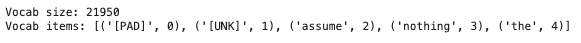

# NLP-Assignment01
**작성자** : `2019136056 박세현`
**제출일** : `2024/03/26`

## 1. 영어로된 영화 리뷰 데이터 전처리 (40점)

- Kaggle에서 제공하는 Movie Review Dataset [https://www.kaggle.com/datasets/vipulgandhi/movie-review-dataset?resource=download](https://www.kaggle.com/datasets/vipulgandhi/movie-review-dataset?resource=download) 를 전처리하여 Vocab을 구성하시오.
    - 제공되는 코드는 해당 데이터를 실습에 사용한 NSMC 데이터의 형식으로 바꾸어주는 코드이다.
        - 단, 실습과 달리 train, val, test의 세 부분으로 나누어짐
    - Vocab 구성시 Whitespace tokenizer를 사용하여야 하며, Data cleaning, Text cleaning 과정을 거치지 않은 기본 Vocab을 생성하시오.

**GRADING**
- Vocab 구현에 성공(+40)

### 1.1 데이터셋 불러오기

```python
with open("train.txt", "r") as file:  
    contents = file.read()  
    lines = contents.split("\n")[1:]  
    train_data = [line.split("\t") for line in lines if len(line) > 0]  
  
with open("val.txt", "r") as file:  
    contents = file.read()  
    lines = contents.split("\n")[1:]  
    validation_data = [line.split("\t") for line in lines if len(line) > 0]  
  
with open("test.txt", "r") as file:  
    contents = file.read()  
    lines = contents.split("\n")[1:]  
    test_data = [line.split("\t") for line in lines if len(line) > 0]
```

### 1.2 Vocabulary 구성

```python
# Build Your Own Vocabulary  
from collections import Counter  
from tqdm import tqdm  
  
whitespace_vocab = {"[PAD]":0, "[UNK]": 1}  
whitespace_vocab_idx = 2  
  
tokenizer = lambda x: x.split()  
  
tokenized_train_dataset = []  
tokenized_validation_dataset = []  
tokenized_test_dataset = []  
  
for data in train_data:  
    tokens = tokenizer(data[1])  
    labels = data[2]  
    tokenized_train_dataset.append((tokens, labels))  
  
for data in validation_data:  
    tokens = tokenizer(data[1])  
    labels = data[2]  
    tokenized_validation_dataset.append((tokens, labels))  
  
for data in test_data:  
    tokens = tokenizer(data[1])  
    labels = data[2]  
    tokenized_test_dataset.append((tokens, labels))  
  
for tokens, _ in tokenized_train_dataset:  
    for token in tokens:  
        if token not in whitespace_vocab:  
            whitespace_vocab[token] = whitespace_vocab_idx  
            whitespace_vocab_idx += 1
```

- `whitespace`, 공백을 기준으로 tokenize하여 vocabulary를 구성했다.

### 1.3 Vocabulary 확인

```python
print(list(whitespace_vocab.items())[:10])
```

- 코드를 실행하면 아래와 같이 구성한 vocabulary를 확인할 수 있다.


---
## 2. 영어로된 영화 리뷰 데이터 분류 모델 학습 (30점)

- 실습에 사용한 모델 및 Dataset 객체를 통해 긍정 부정 분류 모델을 학습하시오.
    - 실습코드와 동일한 구조의 모델을 사용해야함
    - 실습코드와 동일한 Trainer 및 하이퍼 파라미터를 유지해야함
    - Train, Validation, Test 데이터를 모두 학습에 알맞게 사용할 것

**GRADING**
- 모델 구현 및 학습 (+25)
- Train, Validation, Test를 알맞게 사용 (+5)

### 2.1 실습에 사용한 모델 정의
#### SentimentClassifier

```python
import torch  
import torch.nn as nn  
import torch.nn.functional as F  
  
class SentimentClassifier(nn.Module):  
    def __init__(self, vocab_size):  
        super(SentimentClassifier, self).__init__()  
        self.embedding = nn.Embedding(vocab_size, 32)  
        self.fc1 = nn.Linear(32 * 100, 100)  
        self.fc2 = nn.Linear(100, 2)  
  
    def forward(self, x):  
        x = self.embedding(x)  
        x = x.view(-1, 32 * 100)  
        x = F.relu(self.fc1(x))  
        x = self.fc2(x)  
        return x
```

#### SentimentClassifierPL

```python
import lightning as pl  
  
class SentimentClassifierPL(pl.LightningModule):  
    def __init__(self, sentiment_classifier):  
        super(SentimentClassifierPL, self).__init__()  
        self.model = sentiment_classifier  
        self.loss = nn.CrossEntropyLoss()  
  
        self.validation_step_outputs = []  
        self.test_step_outputs = []  
        self.save_hyperparameters()  
  
    def training_step(self, batch, batch_idx):  
        inputs, labels = batch  
        outputs = self.model(inputs)  
        loss = self.loss(outputs, labels)  
        self.log("train_loss", loss)  
        return loss  
  
    def validation_step(self, batch, batch_idx):  
        inputs, labels = batch  
        outputs = self.model(inputs)  
        loss = self.loss(outputs, labels)  
        self.log("val_loss", loss)  
        self.validation_step_outputs.append((loss, outputs, labels))  
        return loss, outputs, labels  
  
    def on_validation_epoch_end(self):  
        outputs = self.validation_step_outputs  
        avg_loss = torch.stack([x[0] for x in outputs]).mean()  
        self.log("avg_val_loss", avg_loss)  
  
        all_outputs = torch.cat([x[1] for x in outputs])  
        all_labels = torch.cat([x[2] for x in outputs])  
        all_preds = all_outputs.argmax(dim=1)  
        accuracy = (all_preds == all_labels).float().mean()  
        self.log("val_accuracy", accuracy)  
        self.validation_step_outputs.clear()  
  
    def test_step(self, batch, batch_idx):  
        inputs, labels = batch  
        outputs = self.model(inputs)  
        loss = self.loss(outputs, labels)  
        self.log("test_loss", loss)  
        self.test_step_outputs.append((loss, outputs, labels))  
        return loss, outputs, labels  
  
    def on_test_epoch_end(self):  
        outputs = self.test_step_outputs  
        avg_loss = torch.stack([x[0] for x in outputs]).mean()  
        self.log("avg_test_loss", avg_loss)  
  
        all_outputs = torch.cat([x[1] for x in outputs])  
        all_labels = torch.cat([x[2] for x in outputs])  
        all_preds = all_outputs.argmax(dim=1)  
        accuracy = (all_preds == all_labels).float().mean()  
        self.log("test_accuracy", accuracy)  
        self.test_step_outputs.clear()  
  
    def configure_optimizers(self):  
        optimizer = torch.optim.Adam(self.model.parameters(), lr=1e-3)  
        return optimizer
```

#### SentimentDataset

```python
from torch.utils.data import Dataset, DataLoader  
  
class SentimentDataset(Dataset):  
    def __init__(self, data, vocab):  
        self.data = data  
        self.vocab = vocab  
  
    def __len__(self):  
        return len(self.data)  
  
    def __getitem__(self, index):  
        label = int(self.data[index][1])  
        tokens = self.data[index][0]  
  
        token_ids = [self.vocab[token] if token in self.vocab else 1 for token in tokens]  
  
        if len(token_ids) > 100:  
            token_ids = token_ids[:100]  
        else:  
            token_ids = token_ids[:100] + [0] * (100 - len(token_ids))  
  
        return torch.tensor(token_ids), torch.tensor(label)
```

#### Method: check_vocab & check_performance
- 실습코드에서 달라진 부분은 **validation_dataset** 을 활용하는 부분이다.
- 실습코드는 **check_performance** 의 인자로 Validation Data를 받지 않았고, Test Data를 대신 활용했었다.
- Validation Data를 활용할 수 있도록 이 부분을 수정해주어야한다.

```python
import wandb  
from lightning.pytorch.loggers import WandbLogger  
  
wandb.login()  
  
def check_vocab_properties(vocab):  
    print(f"Vocab size: {len(vocab)}")  
    print(f"Vocab items: {list(vocab.items())[:5]}")  
  
  
def check_performance(vocab,train_data, val_data, test_data, wandb_log_name):  
    wandb_logger = WandbLogger(project="NLP", name=wandb_log_name, group="HW01")  
  
    model = SentimentClassifier(len(vocab))  
    pl_model = SentimentClassifierPL(model)  
  
    train_dataset = SentimentDataset(train_data, vocab)  
    train_loader = DataLoader(train_dataset, batch_size=64, shuffle=True, num_workers=4)  
    val_dataset = SentimentDataset(val_data, vocab)  
    val_loader = DataLoader(val_dataset, batch_size=64, shuffle=False, num_workers=4)  
    test_dataset = SentimentDataset(test_data, vocab)  
    test_loader = DataLoader(test_dataset, batch_size=64, shuffle=False, num_workers=4)  
  
    trainer = pl.Trainer(max_epochs=1,  
                     accelerator="gpu",  
                     logger=wandb_logger  
                     )  
  
    trainer.fit(model=pl_model,  
                train_dataloaders=train_loader,  
                val_dataloaders=val_loader)  
  
    trainer.test(dataloaders=test_loader)  
  
    wandb.finish()
```

### 2.2 모델 학습

```python
check_vocab_properties(whitespace_vocab)
```

- 학습을 하기 전, `vocab` 에 대한 정보를 확인한다.


- `vocab_size` 는 **43,031** 이다.

```python
check_performance(whitespace_vocab, tokenized_train_dataset, tokenized_validation_dataset, tokenized_test_dataset, "whitespace")
```

- 위 코드를 실행시켜 학습을 진행한다.


- 모델의 정보를 확인할 수 있는데, `whitespace-vocab` 은 **1.7 M** 개의 파라미터를 가지고 있다.


- `test_accuracy` 는 **51.9%** 이다.
- 5회정도 실행해본 결과 약 **50~51%** 사이의 정확도를 보여주는 것으로 확인되었다.

---
## 3. Vocab 개선 (30점)

- 상기 구축한 Vocab을 최적화하여 모델의 성능을 개선하시오.
    - 남이 구축한 Vocab을 가져오는 것을 제외, 모든 것을 허용
- 참고하면 좋은 것
    - 영어의 불용어(Stopword) : [https://gist.github.com/sebleier/554280](https://gist.github.com/sebleier/554280)
    - 영어에 적합한 Tokenizer : NLTK 라이브러리 참고 ([https://www.nltk.org/api/nltk.tokenize.html](https://www.nltk.org/api/nltk.tokenize.html))
    - Regular Expression 사용시 유용한 사이트 : [https://regexr.com/](https://regexr.com/)

**GRADING**
- 수업에 배운 내용을 적용 (+10)
- 적용된 Vocab을 통해 성능 개선 (+10)
- NLTK 등 외부 라이브러리의 tokenzier 및 다양한 정규화 기법을 사용 (+10)

### 3.1 등장 빈도 확인

먼저 token의 등장 빈도를 확인해보고자 실습시간에 배운 `Counter` 를 활용해 등장 빈도를 출력해보았다.

```python
from collections import Counter  
 
token_counter = Counter()  
  
for tokens, _ in tokenized_train_dataset:  
    token_counter.update(tokens)

len(token_counter)
```

```python
print(token_counter.most_common(20))  
print()  
print(token_counter.most_common()[-10:])
```


- 상위 20개의 token과 하위 10개의 token을 출력했다.
- 상위 20개 중 문장부호, 불용어가 대부분을 차지했다.
	- 영화와 관련된 단어는 20위 **film** 이 있었다.

단어들의 분포를 시각화하여 그래프로 그려보았다.

```python
import matplotlib.pyplot as plt  
  
def plot_frequency_distribution(counter):  
    plt.plot(counter.values())  
    plt.ylabel('Token Frequency')  
    plt.show()

plot_frequency_distribution(token_counter)
```


- 실습 때 그래프보다 더 극단적인 모습을 보이는 것 같다.
- 앞서 확인한 상위 분포 (문장 부호, 불용어 등)에 해당하는 단어들만 압도적으로 많이 나오고 있다는 것을 의미한다.
- 문장부호와 불용어는 긍정/부정 분류에 아무런 영향을 미치지 못한다고 생각한다.
- 따라서, 이러한 것들을 처리해주면 성능이 더 올라갈 것이라고 예상했다.

이러한 처리를 하기 전, 실습시간에 배운 것처럼 간단한 처리를 먼저 해보기로 했다.
**등장빈도가 적은 토큰을 제거** 하는 것이다.
약 40,000개 이상의 토큰 중 1번 나온 것은 vocabulary에 유지할 이유가 없다고 생각했기 때문에 이것들을 제거하고 성능의 변화가 있는지 살펴본다.

### 3.2 전처리 : 문장 부호 제거 및 등장 빈도 1회 토큰 제외

```python
import re  
  
tokenizer = lambda x: x.split()  
  
tokenzied_train_dataset = []  
tokenized_validation_dataset = []  
tokenzied_test_dataset = []  
  
for data in train_data:  
    text = re.sub(r'[,.!?;:()\"\'-]', ' ', data[1])  
    tokens = tokenizer(text)  
    labels = data[2]  
    tokenzied_train_dataset.append((tokens, labels))  
  
for data in validation_data:  
    text = re.sub(r'[,.!?;:()\"\'-]', ' ', data[1])  
    tokens = tokenizer(text)  
    labels = data[2]  
    tokenized_validation_dataset.append((tokens, labels))  
  
for data in test_data:  
    text = re.sub(r'[,.!?;:()\"\'-]', ' ', data[1])  
    tokens = tokenizer(text)  
    labels = data[2]  
    tokenzied_test_dataset.append((tokens, labels))  
  
token_counter = Counter()  
  
for tokens, _ in tokenzied_train_dataset:  
    token_counter.update(tokens)
```

- 등장빈도가 적은 토큰을 삭제하기 전에 문장부호 처리는 정규표현식으로 간단히 처리할 수 있어 함께 적용해보았다.


- 문장부호 제거 후의 토큰의 등장빈도이다.
- 문장부호는 사라지고, 이제는 불용어들로 가득찬 모습이다.
- 또한, `be` 로 의미가 합쳐질 수 있는 `is` 도 등장했다.

```python
min_count = 1  
cleaned_vocab = {"[PAD]":0, "[UNK]":1}  
cleaned_vocab_idx = 2  
  
for token, count in token_counter.items():  
    if count > min_count:  
        cleaned_vocab[token] = cleaned_vocab_idx  
        cleaned_vocab_idx += 1
```

- 약간의 전처리를 해준 `cleaned_vocab` 을 구성했다.
- 등장 빈도가 1회인 토큰은 제외했다.



- **vocab_size** 는 `whitespace_vocab` (43,031) 에서 **21,950** 으로 절반 이상이 감소했다.


- 모델의 파라미터가 **1.7M -> 1.0M** 으로 감소했다.


- 성능은 **약 3%** 정도 증가했다.
- 하지만, 등장 빈도 중 불용어의 비중이 높고 의미를 합칠 수 있는 토큰도 보인다.
- 이제는 이들에 대한 처리를 하고 성능을 비교해 볼 필요가 있다.

### 3.3 NLTK 라이브러리 적용

#### 3.3.1 NLTK word_tokenize 적용 및 불용어 제거

가장 먼저, 불용어를 제거해보기로 했다.
등장 빈도 중 가장 높은 불용어를 제거했을 때 영화와 관련한 토큰들이 남는지, 이것이 분류에 영향을 얼마나 미치는지 확인해보기 위해서이다.

NLTK 라이브러리를 사용하면서 tokenizer도 `word_tokenize` 를 사용했다.
Treebank 등 다른 tokenizer들도 찾아보았지만, 우선 기본적인 tokenizer를 사용하기로 했다.

```python
import re  
from tqdm import tqdm  
from nltk.corpus import stopwords  
  
stop_words = set(stopwords.words('english'))  
  
tokenized_train_dataset = []  
tokenized_validation_dataset = []  
tokenized_test_dataset = []  
  
for data in tqdm(train_data):  
    text = re.sub(r'[^\w\s]', ' ', data[1])  
    tokens = word_tokenize(text)  
    tokens = [word for word in tokens if word not in stop_words]  
    labels = data[2]  
    tokenized_train_dataset.append((tokens, labels))  
  
for data in tqdm(validation_data):  
    text = re.sub(r'[^\w\s]', ' ', data[1])  
    tokens = word_tokenize(text)  
    tokens = [word for word in tokens if word not in stop_words]  
    labels = data[2]  
    tokenized_validation_dataset.append((tokens, labels))  
  
for data in tqdm(test_data):  
    text = re.sub(r'[^\w\s]', ' ', data[1])  
    tokens = word_tokenize(text)  
    tokens = [word for word in tokens if word not in stop_words]  
    labels = data[2]  
    tokenized_test_dataset.append((tokens, labels))
```

- `tokenized_dataset` 을 만드는 과정은 다음과 같다.
	- 정규 표현식을 이용해 특수기호 (문장부호)를 제거한다.
	- `word_tokenize()` 를 이용해 tokenize 한다.
	- 다운로드 받은 불용어 목록에 포함된 토큰을 제외한다.


- 상위 등장 빈도 토큰들을 출력해보았다.
- 영화 리뷰 데이터에 어울리는(?) 토큰들 (ex. film, movie, story, character 등)이 상위 등장 빈도 목록에 나타나기 시작했다.

```python
min_count = 1  
remove_stopword_vocab = {"[PAD]":0, "[UNK]":1}  
remove_stopword_vocab_idx = 2  
  
for token, count in token_counter.items():  
    if count > min_count:  
        remove_stopword_vocab[token] = remove_stopword_vocab_idx  
        remove_stopword_vocab_idx += 1
```

- 마찬가지로 등장 빈도가 1회인 토큰은 삭제하고 `remove_stopword_vocab` 을 구성했다.


- **vocab_size** 는 **43,031 -> 21,950 -> 21,670** 순으로 감소했따.


- 파라미터의 수는 동일하게 **1.0M** 으로 변화가 없었다.
	- 사실 불용어가 100몇개 정도이기 때문에 당연한 결과이다.
- 하지만, 성능은 **약 58%** 로 나름 유의미하게 향상된 것을 확인할 수 있다.
	- **50~51% -> 53% -> 58%** 순으로 성능이 향상되었다.

그동안 상위 10개~20개 정도의 토큰만 확인해보다가 범위를 조금 더 확장해보았다.
여기서 발견할 수 있었던 것은 다음과 같다.
- film, films 과 같은 의미는 같으나 단수/복수 명사로 사용된 것
- make/made, go/went 와 같이 역시 의미는 같으나 시제의 차이

즉, 의미가 합쳐질 수 있는 토큰들이 있었다.
이들을 처리해줄 수 있는 것이 `Lemmatization` 과 `Stemming` 이다.

#### 3.3.2 Lemmatization 적용

`Lemmatization` 은 규칙을 기반으로 어간을 추출하는  `Stemming` 과는 다르게 비교적 **온전한 형태의 단어** 를 반환한다.
하지만, 단어의 형태가 온전치 못하거나 단어의 원형을 얻지 못하는 경우가 생기기도 한다.
예를 들면 다음과 같다.

```python
from nltk.stem import WordNetLemmatizer

lemmatizer = WordNetLemmatizer()

print(lemmatizer.lemmatize("dies")) # 결과: dy
print(lemmatizer.lemmatize("went")) # 결과: went
```

- 위와 같은 이유로 `Lemmatization` 을 할 때에는 품사를 option으로 지정해주면 정확한 표제어를 추출할 수 있다.

```python
from nltk.tokenize import word_tokenize   
from nltk import pos_tag  
  
stop_words = set(stopwords.words('english'))  
  
for data in tqdm(train_data):  
    text = re.sub(r'[^\w\s]', ' ', data[1])  
    tokens = word_tokenize(text)
    tokens = pos_tag(tokens)  
  
print(tokens[:20])
```

- 간단한 테스트를 해보았다.

`('fetched', 'JJ'), ('tom', 'JJ'), ('berenger', 'NN'), ('plays', 'NNS'), ('shale', 'VBP')`

- 위와 같이 `pos_tag` 에서 사용하는 품사의 종류는 `Lemmatization` 에서 사용할 `WordNetLemmatizer` 의 품사 태그보다 훨씬 많아 오류를 일으킨다.
- 따라서, 적절히 치환해주는 과정이 한 번 필요하다.

```python
from nltk.corpus import stopwords  
from nltk.stem import WordNetLemmatizer  
from nltk import pos_tag  
  
stop_words = set(stopwords.words('english'))  
lemmatizer = WordNetLemmatizer()  
  
tokenized_train_dataset = []  
tokenized_validation_dataset = []  
tokenized_test_dataset = []  
  
  
def get_pos(tag):  
    if tag.startswith('N'):  
        return 'n'  
    elif tag.startswith('V'):  
        return 'v'  
    elif tag.startswith('J'):  
        return 'a'  
    elif tag.startswith('R'):  
        return 'r'  
    else:  
        return 'n'  # default of WordNetLemmatizer's pos option is 'n'  
  
  
for data in tqdm(train_data):  
    text = re.sub(r'[^\w\s]', ' ', data[1])  
    tokens = word_tokenize(text)  
    tokens = [token for token in tokens if token not in stop_words]  
    tokens = pos_tag(tokens)  
    lemmatized_tokens = []  
    for token, tag in tokens:  
        lemmatized_tokens.append(lemmatizer.lemmatize(token, pos=get_pos(tag)))   
    labels = data[2]  
    tokenized_train_dataset.append((lemmatized_tokens, labels))  
  
for data in tqdm(validation_data):  
    text = re.sub(r'[^\w\s]', ' ', data[1])  
    tokens = word_tokenize(text)  
    tokens = [token for token in tokens if token not in stop_words]  
    tokens = pos_tag(tokens)  
    lemmatized_tokens = []  
    for token, tag in tokens:  
        lemmatized_tokens.append(lemmatizer.lemmatize(token, pos=get_pos(tag)))  
    labels = data[2]  
    tokenized_validation_dataset.append((lemmatized_tokens, labels))  
  
for data in tqdm(test_data):  
    text = re.sub(r'[^\w\s]', ' ', data[1])  
    tokens = word_tokenize(text)  
    tokens = [token for token in tokens if token not in stop_words]  
    tokens = pos_tag(tokens)  
    lemmatized_tokens = []  
    for token, tag in tokens:  
        lemmatized_tokens.append(lemmatizer.lemmatize(token, pos=get_pos(tag)))  
    labels = data[2]  
    tokenized_test_dataset.append((lemmatized_tokens, labels))
```

- 특수기호 제거
- Tokenizing
- 불용어 제거
- 품사 태깅
- Lemmatization

위와 같은 과정을 거쳐 `tokenized_dataset` 을 만들어낸다.


- `Lemmatization` 이 잘 적용되었음을 확인할 수 있다.
	- film, films 두 토큰이 합쳐져 등장 빈도가 증가한 것이 이것을 반증한다.

이제 다시 단어들의 분포를 시각화해보았다.


- 제일 처음 보았던 그래프보다는 덜 극단적인 그래프가 나타났다.
- 일련의 전처리 과정을 통해서 그래프의 변화가 있었다.

```python
min_count = 1  
lemmatized_vocab = {"[PAD]":0, "[UNK]":1}  
lemmatized_vocab_idx = 2  
  
for token, count in token_counter.items():  
    if count > min_count:  
        lemmatized_vocab[token] = lemmatized_vocab_idx  
        lemmatized_vocab_idx += 1
```

- 등장 빈도가 1회인 토큰을 제거하고 `lemmatized_vocab` 을 구성했다.

이 부분에서 몇가지 테스트를 하면서 미처 캡처를 하지는 못했지만, 모델 파라미터는 **899K** 로 또 한번 감소했으며 정확도는 **55.3%** 가 나왔다.
- 성능은 불용어만 처리했을 때 더 좋게 나왔다.

여기서 모델의 파라미터가 감소하고, vocabulary의 크기 또한 줄어들어 오히려 안좋아진 것은 아닐까 생각을 하기도 했었다.
그래서 등장 빈도가 1회인 토큰을 제거하지 않고 학습을 해보았다.


- 모델의 파라미터는 당연히 **1.2M** 으로 증가했다.
- 오히려 이전보다 성능은 증가했다.
- 심지어, 여러 번의 테스트에서 안정적으로 비슷한 수치를 보였다.


---
## 4. 왜 Vocab에 따라 성능이 달라지는가? (Bonus 20점)

- 실습 및 과제를 통해 Vocab에 따라 성능이 차이남을 확인할 수 있음
- 왜 성능이 하락하는지에 대한 자신의 생각을 기술하시오.

**GRADING**
- 자신의 생각을 기술함 (+10)
- 자신의 생각에 근거를 제시함 (+10)

흰트 : Vocab은 **Train 데이터를 통해서 구축**하여 Train, Validation, Test 데이터셋 모두에 사용함 + 단어가 Vocab에 없다면 **Unknown token**을 그자리에 대체함

주의! 흰트로 추론 가능한 이유 이외에도 다양한 이유가 존재. 자유롭게 기술

### 4.1 Wandb 결과 확인


지금까지 5번의 테스트를 진행했고 결과를 요약하면 다음과 같다.

|     wandb_log_name     |             적용한 기법              |  정확도  |
| :--------------------: | :-----------------------------: | :---: |
|      whitespace       | 기본 vocab, whitespace tokenizing | 50.6% |
| whitespace_mc1_cleaned |      등장빈도 1회 제거 및 문장부호 제거       | 53.3% |
|  remove_stopword_mc1   |       불용어 처리 및 등장빈도 1회 제거       |  58%  |
|     lemmatized_mc1     |    Lemmatizing 및 등장빈호 1회 제거     | 55.3% |
|     lemmatized_mc0     |           Lemmatizing           | 56.3% |
- 아래로 진행될 때 이전 단계에서 적용한 기법들을 함께 사용했다.

가장 성능이 좋았던 것은 `불용어` 를 제거했을 때, 58%로 가장 높았다.
- 초기 등장빈도를 확인했을 때 불용어와 문장부호의 비중이 높았었다.
- 이런 것들을 제거했을 때 비로소 영화와 관련한 토큰들이 상위 비중을 차지하기 시작했다.
- 긍정과 부정을 분류하는 `Task` 를 생각했을 때, 불용어 및 문장부호는 모델의 예측에 결정적인 영향을 미치지 못할 가능성이 높기 때문에 이러한 처리를 해주었을 때 좋은 결과가 나타났다고 생각한다.

기대에 못미쳤던 것은 `Lemmatizization` 을 적용한 후의 테스트이다.
- 의미는 같은데 형식이 다른 토큰을 하나의 토큰으로 의미를 통합하면 `Vocab` 의 크기는 줄어든다.
- 이로 인해 동일한 의미가 분산되지 않게 유지할 수 있어 성능이 향상되지 않을까 기대를 했다.
- 정확한 원인은 잘 모르겠다.
- 약 1~2%의 차이이므로 감안할 수 있는 오차일 수도 있고, Lemmatization 중 품사를 제대로 태깅하지 못하거나 `Corpus` 의 오타 등으로 품사를 얻을 수 없는 경우들로 인해 이것들이 노이즈로 작용했을 가능성도 있을 것 같다.

### 4.2 Vocab에 따라 성능이 달라지는 이유

먼저 `Vocab` 은 **Train Data** 로 구축해서 **Validation, Test Dataset** 에 모두 사용한다.
그로 인해 Validation과 Test 데이터에는 Vocab에 없는 토큰이 등장할 수 있고 또한 Vocab에는 있지만 그 단어들이 등장하지 않을 수도 있다. 

만약, Train Data로 구성한 `Vocab`에 없는 단어들이 **Validation, Test Data** 에 많이 등장한다면 이들은 모두 **Unknown Token** 으로 대체되면서 정보의 손실이 발생할 수밖에 없다. 그로 인해 모델의 예측 성능이 하락한다고 생각한다.

반대로 우리가 Train, Validation, Test 데이터로 분할하고 어떤 정규화를 진행할 때 Train 데이터에만 진행해 사용하는 것은 모델의 `Generalization` 성능을 높이기 위함이다. `Vocab` 을 구성할 때 적절한 전처리 및 정규화 과정을 Task에 맞게 적절히 적용한다면 성능은 올라갈 수 있다고 생각한다.

따라서, `Vocab` 은 모델의 성능을 결정하는 중요한 요소 중 하나라고 생각한다.

