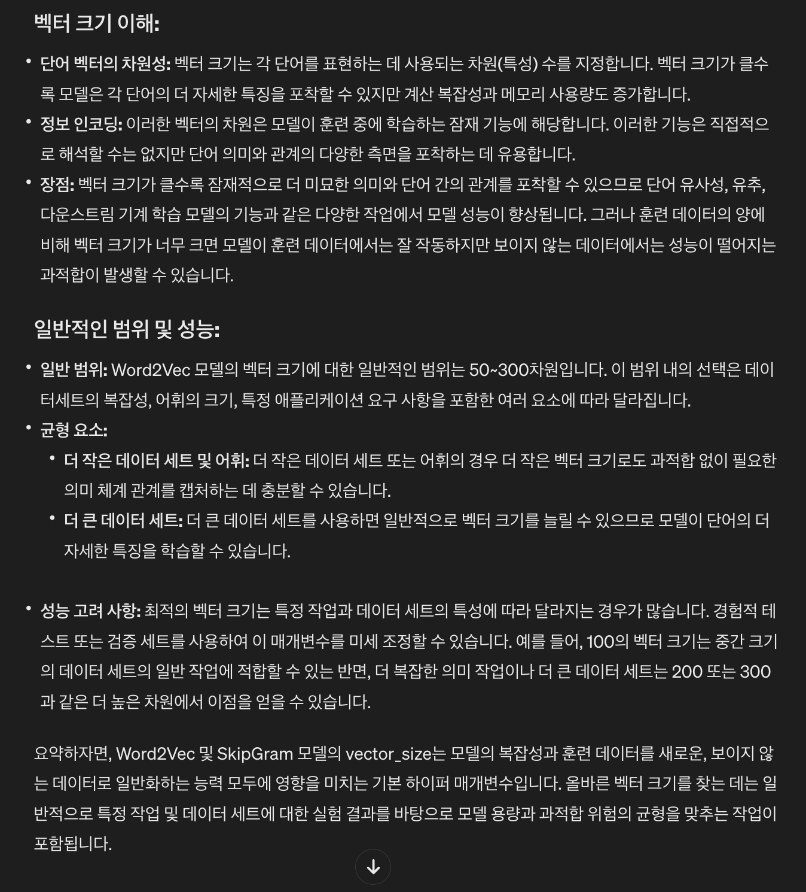

# NLP Assignment02
**작성자** : `2019136056 박세현`
**제출일** : `2024/04/09`

## 1. IMDB 데이터 처리 (20점)

- stanford 대학에서 제공하는 IMDB 영화 리뷰 데이터(https://ai.stanford.edu/~amass/data/sentiment/)를 다운 받아 학습, 테스트 데이러를 구성하시오.
	- 데이터는 영어 텍스트 데이터로 긍정/부정의 Binary Classification 데이터셋임
	- 데이터셋의 압축을 해제했을 때의 각 디렉토리의 용도는 다음과 같음.
		- train/pos : 긍정 label의 학습 데이터
		- train/neg : 부정 label의 학습 데이터
		- test/pos : 긍정 label의 테스트 데이터
		- test/neg : 부정 label의 테스트 데이터
	- 지금껏 배운 다양한 기법을 적용해 tokenizing, nomalizing 등을 진행한 후 vocab을 구축하여야함.

**GRADING**
- 데이터셋 전처리를 통해 vocab을 구축 (+20)

### 1.1 데이터셋 불러오기

```shell
!tar -xzf /content/aclImdb_v1.tar.gz
```
- `aclImdb_v1.tar.gz` 파일을 Colab에 업로드하여 압축해제 후 전처리 코드를 적용한다.

```python
from pathlib import Path  
  
raw_data_dir = './aclImdb'  
data_dir = Path(raw_data_dir)  
  
train_datas = []  
test_datas = []  
  
for sentiment in ["pos", "neg"]:  
    samples = list(data_dir.glob(f"train/{sentiment}/*.txt"))  
    train_datas.extend(samples)  
  
for sentiment in ["pos", "neg"]:  
    samples = list(data_dir.glob(f"test/{sentiment}/*.txt"))  
    test_datas.extend(samples)  
  
train_file = open("train.txt", "w", encoding="utf-8")  
test_file = open("test.txt", "w", encoding="utf-8")  
  
for file, datas in [(train_file, train_datas), (test_file, test_datas)]:  
    file.write("id\ttext\tlabel\n")  
    for data in datas:  
        lines = [line.strip().replace("\t", " ") for line in data.open().readlines()]  
        text = " ".join(lines)  
        id = data.name[:-4]  
        label = 1 if "pos" in data.parts else 0  
        file.write(f"{id}\t{text}\t{label}\n")  
      
train_file.close()  
test_file.close()
```

- 다운로드 받은 데이터셋의 폴더 경로를 저장하고 `pos, neg` 폴더에 접근해 `train_datas, test_datas` 를 만든다.
- `train.txt, test.txt` 파일로 형식을 맞춰 저장한다.
	- 이때, `\t` 을 제거한 이유는 후에 전처리를 수행하는 코드에서 몇개의 데이터에 의한 문제가 발생했고, 그 원인이 텍스트 중간에 탭 문자가 들어가 있었기 때문이었다.
	- 따라서 `\t` 문자를 사전에 제거하였다.

```python
with open("train.txt", "r", encoding="utf-8") as file:  
    contents = file.read()  
    lines = contents.split("\n")[1:]  
    train_data = [line.split("\t") for line in lines if len(line) > 0]  
  
with open("test.txt", "r", encoding="utf-8") as file:  
    contents = file.read()  
    lines = contents.split("\n")[1:]  
    test_data = [line.split("\t") for line in lines if len(line) > 0]
```

### 1.2 Vocabulary 구축

```python
import nltk  
  
nltk.download('punkt')  
nltk.download('stopwords')
```

```python
import re  
from tqdm import tqdm  
from nltk.tokenize import word_tokenize  
from nltk.corpus import stopwords  
from nltk.stem import PorterStemmer  
  
stop_words = set(stopwords.words('english'))  
stemmer = PorterStemmer()  
  
tokenized_train_dataset = []  
tokenized_test_dataset = []  
  
for data in tqdm(train_data):  
    text = data[1].lower().replace('<br />', '')  # Remove <br /> tags and lowercase  
    text = re.sub(r'[^\w\s]', '', text)  # Remove punctuation  
    tokens = word_tokenize(text)  
    tokens = [word for word in tokens if word not in stop_words]  
    tokens = [stemmer.stem(word) for word in tokens]  
    labels = data[2]  
    tokenized_train_dataset.append((tokens, labels))  
  
for data in tqdm(test_data):  
    text = data[1].lower().replace('<br />', '')  # Remove <br /> tags and lowercase  
    text = re.sub(r'[^\w\s]', '', text)  # Remove punctuation  
    tokens = word_tokenize(text)  
    tokens = [word for word in tokens if word not in stop_words]  
    tokens = [stemmer.stem(word) for word in tokens]  
    labels = data[2]  
    tokenized_test_dataset.append((tokens, labels))
```

- 데이터 전처리 과정은 다음과 같다.
	- 데이터를 소문자로 변환하며 `<br />` 태그를 제거한다.
	- 문장부호 및 특수문자를 제거한다.
	- **word_tokenize** 를 이용해 tokenizing 한다.
	- `불용어` 를 제거한다.
	- **PorterStemmer** 를 이용해 stemming을 한다.

```python
from collections import Counter  
  
token_counter = Counter()  
  
for tokens, _ in tokenized_train_dataset:  
    token_counter.update(tokens)  
  
min_count = 2  
vocab = {"[PAD]":0, "[UNK]":1}  
vocab_idx = 2  
  
for token, count in token_counter.items():  
    if count > min_count:  
        vocab[token] = vocab_idx  
        vocab_idx += 1
```

- 2번 이하로 등장하는 토큰은 제외하고 **vocab** 을 구축하였다.


- 자주 등장하는 토큰과 그렇지 않은 토큰을 출력한 결과는 위와 같다.
- `Stemming` 을 적용했기 때문에 **movi, charact** 와 같은 형태로 단어가 변경된 것을 확인할 수 있다.

```python
word2vec_train_datas = []  
for train_text, _ in tokenized_train_dataset:  
    word2vec_train_datas.append([word for word in train_text])
```

```python
from gensim.models import Word2Vec  
  
SkipGram_W2V = Word2Vec(sentences = word2vec_train_datas, vector_size = 200, window = 5, min_count = 1, workers = 4, sg = 1)
```

- `vector_size` 는 일반적으로 100~300 사이로 결정한다고 한다.
- 데이터셋의 복잡성, vocab의 크기 등 여러 요소를 고려해 결정을 하는데 아직 경험이 부족하므로 실험을 통해 좋은 성능을 보이는 `vector_size` 를 선택하기로 했다.
	- `[32, 100, 200, 300]` 을 동일한 환경에서 테스트 했을 때, 나의 경우 **vector_size = 200** 이 가장 좋은 성능을 보였다.
	- 따라서, 이 Task에서 `vector_size` 는 **200** 으로 결정한다.
- 
- 

```python
import numpy as np  
  
embedding_list = []  
  
for token, idx in vocab.items():  
    if token in SkipGram_W2V.wv:  
        embedding_list.append(SkipGram_W2V.wv[token])  
    elif token == "[PAD]":  
        embedding_list.append(np.zeros(SkipGram_W2V.wv.vectors.shape[1]))  
    elif token == "[UNK]":  
        embedding_list.append(np.random.uniform(-1, 1, SkipGram_W2V.wv.vectors.shape[1]))  
    else:  
        embedding_list.append(np.random.uniform(-1, 1, SkipGram_W2V.wv.vectors.shape[1]))  
  
embedding_lookup_matrix = np.vstack(embedding_list)  
  
print(embedding_lookup_matrix.shape)  
print(len(vocab))
```


---

## 2. 데이터셋 통계 분석 (30점)

- 1에서 처리한 vocab을 통해 tokenizing 된 데이터셋의 여러 통계를 계산하시오.
	- 통계의 예시
		- 학습/테스트 문서의 수
		- 학습/테스트 데이터의 평균 token 수
		- 데이터의 token histogram
		- 학습/테스트에서의 UNK token의 수
		- 각 token의 빈도 그래프
		- 긍정/부정의 token 빈도 차이
		- 긍정/부정의 frequent/rare token
- 이전 실습까지 사용한 코드 및 검색을 활용해 최소 1개의 그래프를 그려야 함.

**GRADING**
- 분석한 통계의 수 (+5)

```python
import matplotlib.pyplot as plt  
from collections import Counter
```

### 2.1 학습/테스트 문서의 수

```python
print('Train Document : ', len(tokenized_train_dataset))  
print('Test Document : ', len(tokenized_test_dataset))
```


### 2.2 학습/테스트 데이터의 평균 token 수

```python
train_avg_tokens = sum(map(lambda x: len(x[0]), tokenized_train_dataset))
							/ len(tokenized_train_dataset)  
test_avg_tokens = sum(map(lambda x: len(x[0]), tokenized_test_dataset))
							/ len(tokenized_test_dataset)  
  
print('학습 데이터의 평균 token 수: ', train_avg_tokens)  
print('테스트 데이터의 평균 token 수: ', test_avg_tokens)
```


### 2.3 데이터의 token histogram

```python
# 데이터의 token histogram
train_tokens = [len(tokens) for tokens, _ in tokenized_train_dataset]
test_tokens = [len(tokens) for tokens, _ in tokenized_test_dataset]

# Train
plt.hist(train_tokens, bins=100)
plt.title('Training Data Token Histogram')
plt.xlabel('Token Count')
plt.ylabel('Frequency')
plt.axvline(x=train_avg_tokens, color='red', linestyle='--', label='Average')
plt.legend()
plt.show()

# Test
plt.hist(test_tokens, bins=100)
plt.title('Test Data Token Histogram')
plt.xlabel('Token Count')
plt.ylabel('Frequency')
plt.axvline(x=train_avg_tokens, color='red', linestyle='--', label='Average')
plt.legend()
plt.show()
```


### 2.4 학습/테스트 데이터에서 UNK token 수

```python
UNK_token_train = sum(1 for tokens, _ in tokenized_train_dataset for token in tokens if token not in vocab)  
UNK_token_test = sum(1 for tokens, _ in tokenized_test_dataset for token in tokens if token not in vocab)  
  
print('학습 데이터에서 UNK token의 수: ', UNK_token_train)  
print('테스트 데이터에서 UNK token의 수: ', UNK_token_test)
```


### 2.5 각 token의 빈도 그래프

```python
# 각 token의 빈도 그래프
train_token_counter = Counter(train_tokens)
test_token_counter = Counter(test_tokens)

plt.figure(figsize=(20, 10))  
plt.subplot(1, 2, 1)  
plt.bar(*zip(*train_token_counter.most_common(20)))  
plt.title("Top 20 Tokens in Train Data")  
plt.xlabel("Token")  
plt.ylabel("Frequency")  
plt.xticks(rotation=45)
plt.subplot(1, 2, 2)  
plt.bar(*zip(*test_token_counter.most_common(20)))  
plt.title("Top 20 Tokens in Test Data")  
plt.xlabel("Token")  
plt.ylabel("Frequency")  
plt.xticks(rotation=45)  
plt.tight_layout()  
plt.show()
```


### 2.6 긍정/부정 token의 빈도 차이

```python
pos_train_tokens = [token for tokens, label in tokenized_train_dataset if label == '1' for token in tokens]  
neg_train_tokens = [token for tokens, label in tokenized_train_dataset if label == '0' for token in tokens]  
  
pos_token_counter = Counter(pos_train_tokens)  
neg_token_counter = Counter(neg_train_tokens)  
  
print('긍정 token 수: ', len(pos_train_tokens))  
print('부정 token 수: ', len(neg_train_tokens))  
  
plt.figure(figsize=(12, 6))  
plt.bar(*zip(*pos_token_counter.most_common(20)), color='b', alpha=0.5, label='Positive')  
plt.bar(*zip(*neg_token_counter.most_common(20)), color='r', alpha=0.5, label='Negative')  
plt.title("Top 20 Tokens by Sentiment")  
plt.xlabel("Token")  
plt.ylabel("Frequency")  
plt.xticks(rotation=45)  
plt.legend()  
plt.tight_layout()  
plt.show()
```


### 2.7 긍정/부정의 frequent/rare token

```python
# 긍정/부정의 frequent/rare token
pos_frequent_tokens = pos_token_counter.most_common(10)
pos_rare_tokens = pos_token_counter.most_common()[-10:]

neg_frequent_tokens = neg_token_counter.most_common(10)
neg_rare_tokens = neg_token_counter.most_common()[-10:]

print('긍정 frequent token: ', pos_frequent_tokens)
print('긍정 rare token: ', pos_rare_tokens)
print('부정 frequent token: ', neg_frequent_tokens)
print('부정 rare token: ', neg_rare_tokens)
```


---

## 3. Classification 모델 구축 및 학습 (50점)

- 이론 및 실습 수업을 통해 배운 MLP, CNN, RNN을 사용하여 각자의 모델을 구축하시오.
	- 모델의 크기는 ModelSummary 기준 500MB의 메모리를 초과하면 안됨.
	- 모델은 최대 10 epoch 학습 할 수 있음 (적게 학습하는 것은 ok)
- 최대한 높은 성능을 기록하는 모델을 구축하여야 함.
	- 학습에 주어진 학습 데이터만을 사용하여야 함.
	- 테스트 데이터를 학습에 사용하면 0점
	- 단, 테스트 데이터에 대한 통계를 보고 모델을 구축하는 것은 가능!
- 모델 구성에 있어 왜 자신이 그런 모델 구조를 설계 하였는지 설명을 하여야함.

**GRADING**
- 모델 구축 및 학습 (+20)
- 모델에 대한 설명 (+10)
- 모델 성능에 따른 성적
	- 상위 0~30% : +20
	- 상위 30~50% : +15
	- 상위 50~70% : +10
	- 상위 70~100% : +5

### 3.1 Padding

텍스트는 데이터 별로 길이가 다르다.
GPU 연산을 하기 위해 길이가 같은 벡터를 모아 matrix를 만들기 위해 `PAD` 토큰을 추가하는 작업이 필요하다.
이때, 그 기준을 몇으로 잡을 것인지 정할 필요가 있다.
현재 데이터셋에서 텍스트의 최대 길이와 평균 길이를 확인하고 임계값을 임의로 지정해 길이가 그 이하인 비율을 확인해보며 적정한 값을 찾아본다.

```python
import matplotlib.pyplot as plt

print('리뷰의 최대 길이: ', max(len(text) for text, _ in tokenized_train_dataset))
print('리뷰의 평균 길이: ', sum(map(lambda x: len(x[0]), tokenized_train_dataset)) / len(tokenized_train_dataset))

plt.hist([len(text) for text, _ in tokenized_train_dataset], bins=50)
plt.xlabel('length of text')
plt.ylabel('number of text')
plt.show()
```


- 최대 길이는 `1429` 이고, 평균 길이는 `121` 이다.
- 또한 그래프를 통해 확인했을 때 대략 200~350 보다 작은 토큰들이 큰 비중을 이루고 있는 것으로 보인다.
- 그러므로 최대 길이 `1429` 로 모든 텍스트에 패딩을 추가하는 것은 알맞지 않다.

```python
threshold = 250

count = 0

for text, _ in tokenized_train_dataset:
	if(len(text) <= threshold):
		count += 1

ratio = count / len(tokenized_train_dataset) * 100
print('tokenized_train_dataset 중 길이가 %s 이하인 텍스트의 비율: %s' %(threshold, ratio))
```

- 임의의 `threshold` 를 설정하고, 해당 길이로 패딩을 했을 때 몇 개의 텍스트가 손상되지 않는지 확인한다.
- `threshold = 250` 인 경우 90%의 텍스트는 보존할 수 있다. 
	- `threshold = 500` : 99%의 텍스트 보존
	- `threshold = 300` : 93%의 텍스트 보존
	- `threshold = 200` : 85%의 텍스트 보존
- 따라서 길이는 500으로 정하였다.

### 3.2 Dataset, Lightning Module 정의

```python
import torch  
from torch.utils.data import Dataset, DataLoader  
  
# define dataset class  
class SentimentDataset(Dataset):  
    def __init__(self, data, vocab):  
        self.data = data  
        self.vocab = vocab  
  
    def __len__(self):  
        return len(self.data)  
  
    def __getitem__(self, index):  
        label = int(self.data[index][1])  
        tokens = self.data[index][0]  
  
        token_ids = [self.vocab[token] if token in self.vocab else 1 for token in tokens]  
          
        if len(token_ids) > 500:  
            token_ids = token_ids[:500]  
        else:  
            token_ids = token_ids[:500] + [0] * (500 - len(token_ids))  
  
        return torch.tensor(token_ids), torch.tensor(label)
```

- 위에서 정한 것과 같이 패딩은 **500** 으로 결정한다.

```python
import torch.nn as nn  
import lightning as pl  
  
class SentimentClassifierPL(pl.LightningModule):  
    def __init__(self, sentiment_classifier):  
        super(SentimentClassifierPL, self).__init__()  
        self.model = sentiment_classifier  
        self.loss = nn.CrossEntropyLoss()  
          
        self.validation_step_outputs = []  
        self.test_step_outputs = []  
        self.save_hyperparameters()  
      
    def training_step(self, batch, batch_idx):  
        inputs, labels = batch  
        outputs = self.model(inputs)  
        loss = self.loss(outputs, labels)  
        self.log("train_loss", loss)  
        return loss  
      
    def validation_step(self, batch, batch_idx):  
        inputs, labels = batch  
        outputs = self.model(inputs)  
        loss = self.loss(outputs, labels)  
        self.log("val_loss", loss)  
        self.validation_step_outputs.append((loss, outputs, labels))  
        return loss, outputs, labels  
      
    def on_validation_epoch_end(self):  
        outputs = self.validation_step_outputs  
        avg_loss = torch.stack([x[0] for x in outputs]).mean()  
        self.log("avg_val_loss", avg_loss)  
          
        all_outputs = torch.cat([x[1] for x in outputs])  
        all_labels = torch.cat([x[2] for x in outputs])  
        all_preds = all_outputs.argmax(dim=1)  
        accuracy = (all_preds == all_labels).float().mean()  
        self.log("val_accuracy", accuracy)  
        self.validation_step_outputs.clear()  
      
    def test_step(self, batch, batch_idx):  
        inputs, labels = batch  
        outputs = self.model(inputs)  
        loss = self.loss(outputs, labels)  
        self.log("test_loss", loss)  
        self.test_step_outputs.append((loss, outputs, labels))  
        return loss, outputs, labels  
      
    def on_test_epoch_end(self):  
        outputs = self.test_step_outputs  
        avg_loss = torch.stack([x[0] for x in outputs]).mean()  
        self.log("avg_test_loss", avg_loss)  
          
        all_outputs = torch.cat([x[1] for x in outputs])  
        all_labels = torch.cat([x[2] for x in outputs])  
        all_preds = all_outputs.argmax(dim=1)  
        accuracy = (all_preds == all_labels).float().mean()  
        self.log("test_accuracy", accuracy)  
        self.test_step_outputs.clear()  
          
    def configure_optimizers(self):  
        optimizer = torch.optim.Adam(self.model.parameters(), lr=1e-4, weight_decay=0.01)  
        return optimizer
```

- 기존 실습 코드에서 **weight_decay = 0.01** 을 추가했다.
	- `L2 Regularization`

```python
import wandb  
from lightning.pytorch.loggers import WandbLogger  
from lightning.pytorch.callbacks import ModelSummary  
  
wandb.login()  
  
def check_vocab_properties(vocab):  
    print(f"Vocab size: {len(vocab)}")  
    print(f"Vocab items: {list(vocab.items())[:5]}")  
  
  
def check_performance(model, vocab,train_data, test_data, max_epochs, wandb_log_name):  
    wandb_logger = WandbLogger(project="NLP", name=wandb_log_name, group="HW02")  
  
    pl_model = SentimentClassifierPL(model)  
  
    train_dataset = SentimentDataset(train_data, vocab)  
    train_loader = DataLoader(train_dataset, batch_size=64, shuffle=True, num_workers=4)  
    val_dataset = SentimentDataset(test_data, vocab)  
    val_loader = DataLoader(val_dataset, batch_size=64, shuffle=False, num_workers=4)  
    test_dataset = SentimentDataset(test_data, vocab)  
    test_loader = DataLoader(test_dataset, batch_size=64, shuffle=False, num_workers=4)  
  
    trainer = pl.Trainer(  
        max_epochs=max_epochs,  
        accelerator="gpu",  
        logger=wandb_logger,  
        callbacks=[ModelSummary(max_depth=2)]  
    )  
  
    trainer.fit(  
        model=pl_model,  
        train_dataloaders=train_loader,  
        val_dataloaders=val_loader  
    )  
  
    trainer.test(dataloaders=test_loader)  
  
    wandb.finish()
```

- `validation_dataset` 은 `test_data` 로 설정한다.
- 또한, `epoch` 에 따른 성능 차이를 실험하기 위해 `check_performance` 함수의 인자로 이를 받도록 변경했다.

### 3.3 모델 구축 및 학습

성능이 가장 좋게 나온 모델을 제시하기 전, 과제를 진행하며 실험한 것들에 대한 요약을 먼저 제시한다.


가장 먼저 실습 시간을 통해 배운 4가지 모델 (MLP, TextCNN, LSTM, BiLSTM) 을 적절히 변경해 테스트를 해보았다.
이것들의 결과를 요약하면 다음과 같다.

- `MLP` : Test Accuracy **84.95%**
- `TextCNN (epoch 2)` : Test Accuracy **87.92%**
- `LSTM` : Test Accuracy **83.13%**
- `TextCNN (epoch 5)` : Test Accuracy **87.43%**
- `BiLSTM` : Test Accuracy **85.84%**

5개의 결과 외에도 epoch, vector_size 등을 변경하며 많은 시도를 해봤지만 해당 결과물들이 가장 높은 성능을 보이는 것들이었다.
대체적으로 RNN 계열의 모델들의 성능이 TextCNN보다 낮게 나왔다.
따라서, TextCNN을 중점적으로 성능을 개선하려는 시도를 여러차례 해보았다.


여기서 시도한 것들은 다음과 같다.
- 먼저, 가장 최적의 epoch가 어디일 것인가를 찾으려 노력했다.
- 또한, SkipGram 대신 사전 학습된 `Glove` 를 가져와 적용해보았다.
	- 결과적으로 **glove50d, glove100d, glove200d** 모두 성능에 큰 영향을 주지는 못했다.
- vector_size를 300까지도 늘려보았지만, 증가하는 성능 대비 학습 소요 시간이 너무 길어져 적절한 Trade-off를 해야 했다.
	- 따라서 `vector_size` 는 **200** 으로 결정한 것이 이 실험으로 인한 결과이다.

### 3.4 최종 모델


최종적으로 선택한 모델은 `CNN-LSTM` 모델이다.

- CNN이 Sentiment Classification Task에서 가지는 내가 생각하는 장점은 다음과 같다.
	- CNN은 지역적 특징 추출에 탁월하므로 감정을 결정하는 중요한 단어 및 n-gram과 같은 중요한 특징을 잘 파악할 수 있다.
	
- LSTM이 Sentiment Classification Task에서 가지는 내가 생각하는 장점은 다음과 같다.
	- Sentence, Sequence의 전체 구조 및 텍스트의 순서에 따라 달라질 수 있는 것들을 예측하는데 장점이 있다.
	- 예를 들어 긍정의 표현이 나왔지만 전체를 읽어보면 부정의 리뷰인 것들이 있을 수 있다.

따라서, 이 두 모델의 장점을 모두 사용할 수 있는 `CNN-LSTM` 모델로 이 문제를 해결해보고 싶었다.
- 먼저 Convolution Layer를 통과하며 감정을 나타내는 핵심 단어 혹은 문구를 파악하고, 이것을 LSTM의 입력으로 전달한다.
- 특징 추출을 위한 CNN과 Sequence Modeling을 위한 LSTM을 함께 활용해 중요한 단어를 파악하고 다양한 길이의 데이터에 대한 예측 성능이 올라가지 않을까 기대한다.

```python
class CNNwithLSTM(nn.Module):  
    def __init__(self, vocab_size):  
        super(CNNwithLSTM, self).__init__()  
        self.embedding = nn.Embedding.from_pretrained(torch.FloatTensor(embedding_lookup_matrix), freeze=False)  
  
        self.conv1 = nn.Conv2d(1, 128, (3, 200))  
        self.conv2 = nn.Conv2d(1, 128, (5, 200))  
        self.conv3 = nn.Conv2d(1, 128, (7, 200))  
        self.conv4 = nn.Conv2d(1, 128, (9, 200))  
  
        self.dropout = nn.Dropout(0.5)  
        self.bn = nn.BatchNorm1d(128)  
  
        self.rnn = nn.LSTM(128, 128, batch_first=True, num_layers=1, bidirectional=False)  
        self.fc = nn.Linear(4*128, 2)  
      
    def forward(self, x):  
        embedding = self.embedding(x).unsqueeze(1)  
  
        conv1_feature = F.relu(self.conv1(embedding).squeeze(3))  
        conv2_feature = F.relu(self.conv2(embedding).squeeze(3))  
        conv3_feature = F.relu(self.conv3(embedding).squeeze(3))  
        conv4_feature = F.relu(self.conv4(embedding).squeeze(3))  
  
        max1 = F.max_pool1d(conv1_feature, conv1_feature.size(2)).squeeze(2)  
        max2 = F.max_pool1d(conv2_feature, conv2_feature.size(2)).squeeze(2)  
        max3 = F.max_pool1d(conv3_feature, conv3_feature.size(2)).squeeze(2)  
        max4 = F.max_pool1d(conv4_feature, conv4_feature.size(2)).squeeze(2)  
          
        max1 = self.bn(self.dropout(max1))  
        max2 = self.bn(self.dropout(max2))  
        max3 = self.bn(self.dropout(max3))  
        max4 = self.bn(self.dropout(max4))  
  
        rnn1, _ = self.rnn(max1)  
        rnn2, _ = self.rnn(max2)  
        rnn3, _ = self.rnn(max3)  
        rnn4, _ = self.rnn(max4)  
          
        x = torch.cat([rnn1, rnn2, rnn3, rnn4], dim=1)  
  
        x = self.fc(x)  
  
        return x
```

- 모델은 Multi Branch 형식으로 구성했다.
- 4개의 Convolution Layer가 병렬로 위치하고, 각각 커널은 `[3, 5, 7, 9]` 로 결정했다.
	- Conv Layer를 통과한 후 Activation은 ReLU를 사용한다.
- 또한 각각 Max Pooling을 적용한다.
- 그 후에 Batch Normalization과 Dropout (0.5) 를 적용한다.
- 각각의 출력은 LSTM 모델의 입력으로 들어간다.
- LSTM 모델의 출력은 하나로 합쳐져 Fully Conntected Layer를 통과해 최종 Output이 나온다.

```python
cnn_lstm_model = CNNwithLSTM(len(vocab))
check_performance(cnn_lstm_model, vocab, tokenized_train_dataset, tokenized_test_dataset, 3, "cnn_lstm_epoch3_dim200")
```

- 모델 선언 및 학습 코드이다.
- 최종적으로 epoch 3에서 가장 좋은 성능이 나왔다.


- Model Summary는 위와 같다.

학습한 최종 결과는 다음과 같다.


- **Test Accuracy 88.4%** 

마지막으로 Wandb 그래프는 다음과 같다.


## 🐮🍊 소감

이번 과제를 진행하면서 실습시간에 배운 모델들을 가지고 여러가지 변형도 해보면서 다양한 시도를 해보았다.
딥러닝 그리고 자연어처리가 왜 **상황과 목적에 맞게** 선택해야 하고 정답이 없는지 다시금 느낀 것 같다.

정확도 1%를 올리기 위해 정말 많이 검색도 해보고 공부했던 것들을 떠올려 보았는데 생각보다 정확도를 많이 못 올린 느낌이 든다.
그러한 이유는 `TextCNN` 모델을 실습 코드에서 가지고와서 `vector_size = 100` 으로 embedding 을 만들고 학습을 돌렸을 때 바로 87% 정도의 정확도가 나왔기 때문이다.
별 다른 시도를 안한 것 같은데 생각보다 괜찮은 수치가 나왔다는 것, 그리고 내가 한 시도들이 정확도를 크게 높이지 않는다는 이유로 그런 느낌이 드는 것이 아닌가 생각이 든다.

결론적으로 처음 시도했던 것보다 높은 정확도를 이끌어낼 수 있는 모델을 설계하고 성능 향상이 있었다는 것에 의의를 둔다.