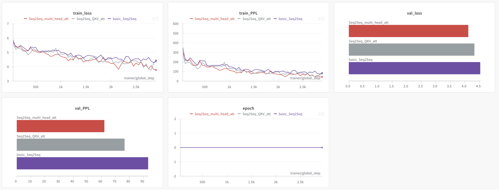

# NLP Assignment03
**작성자** : `2019136056 박세현`
**제출일** : `2024/04/30`

## 1. ENCODER 개선 (30점)

- 실습수업에 사용한 Seq-to-Seq 모델의 Encoder를 개선하시오.
	- 합리적 이유에 기반해 개선 방법을 찾고 구현 및 실험하시오.
		- 여러 제약사항(컴퓨팅, 메모리 등)이 있으므로 꼭 성능이 높아져야 하는 것은 아님.
	- 왜 그런 모델 구성을 생각했는지, 그 결과가 어떻게 나타났는지 기술하시오.
		- 성능이 높아졌다면 왜 그렇다고 생각하는지, 낮아졌다면 무엇이 문제인 것 같은지
	- Hint
		- 꼭 Encoder의 구조가 RNN 계열의 모델이어야 하는가?
		- Bi-directional RNN을 사용한다면?
		- ...

**GRADING**
- 적용한 방법 1개당 (+15)

### (1) Bi-directional RNN을 Encoder에 사용해보자!

```python
class Encoder(nn.Module):
	def __init__(self, input_dim, emb_dim, hid_dim, n_layers, dropout):
		super().__init__()
		self.embedding = nn.Embedding(input_dim, emb_dim)
		self.rnn = nn.LSTM(emb_dim, hid_dim, n_layers, dropout = dropout)
		self.dropout = nn.Dropout(dropout)

	def forward(self, src):
		embedded = self.dropout(self.embedding(src))
		outputs, (hidden, cell) = self.rnn(embedded)
		return outputs, hidden, cell
```

실습 때 사용한 Encoder 는 위와 같이 기본적인 LSTM 모델로 구성되어 있다.
만약, LSTM 대신 BiLSTM 을 사용하면 어떨까?

BiLSTM은 입력을 양방향으로 입력을 처리해 Sequence 에서 더 많은 정보를 추출할 수 있다. 따라서, 단방향 LSTM 을 사용했을 때보다 더 많은 정보를 Decoder 에 건내줄 수 있기 때문에 기존 Encoder 를 사용했을 때보다 성능이 개선되지 않을까 생각한다.

```python
class Encoder(nn.Module):
	def __init__(self, input_dim, emb_dim, hid_dim, n_layers, dropout):
		super().__init__()
		self.embedding = nn.Embedding(input_dim, emb_dim)
		self.rnn = nn.LSTM(emb_dim, hid_dim, n_layers, dropout = dropout, bidirectional=True)
		self.dropout = nn.Dropout(dropout)

	def forward(self, src):
		embedded = self.dropout(self.embedding(src))
		outputs, (hidden, cell) = self.rnn(embedded)
		return outputs, hidden, cell
```

- 코드로 구현하면 위와 같다. LSTM 모델의 *bidrectional* 인자를 *True* 로 설정해주면 된다.

```python
encoder = Encoder(input_dim=len(en_vocab),
				emb_dim=emb_dim,
				hid_dim=hid_dim,
				n_layers=n_layers,
				dropout=0.5)

for batch in train_loader:
	src = batch["src"].permute(1, 0)
	encoder.forward(src=src)
	break
```

- 위와 같이 Encoder 를 정의하고 *forward* 를 1회 수행했을 때, BiLSTM 출력의 size 를 찍어보면 다음과 같다.


- 기존 단방향 LSTM 의 출력과 특정 부분에서 차이가 발생한다.

```text
torch.Size([30, 64, 512])
torch.Size([2, 64, 512])
torch.Size([2, 64, 512])
```

- outputs : sequence length 30, batch size 64, hidden dimension 512
	- `BiLSTM` 은 양방향으로 처리하기 때문에 hidden dimension 이 **1024** 이다.
- hidden, cell : hidden or cell state layer 2, batch size 64, hidden dimension 512
	- `BiLSTM` 은 역시 양방향으로 처리하기에 hidden, cell state 의 결과가 4가 된다.

위 코드와 같이 *outputs, hidden, cell* 을 그대로 반환하면 Decoder 는 이를 받지 못한다.
따라서 Encoder 의 출력을 Decoder 에 보내기 위해서 출력을 조정해주어야 한다. 이때, 몇가지 방법을 생각해볼 수 있다.
- 양방향 정보를 단순히 `concat` 한다.
- 양방향 정보를 `sum` 한다.
- 양방향 정보를 `평균` 을 낸다.
- 양방향 정보를 `Linear Layer` 를 통과시킨다.

어떤 방법이 좋을지 3가지 방법 (concat, average, linear layer) 에 대한 실험을 진행해본다.

**1. Concat**
```python
class Encoder(nn.Module):
	def __init__(self, input_dim, emb_dim, hid_dim, n_layers, dropout):
		super().__init__()
		self.embedding = nn.Embedding(input_dim, emb_dim)
		self.rnn = nn.LSTM(emb_dim, hid_dim, n_layers, dropout = dropout, bidirectional=True)
		self.dropout = nn.Dropout(dropout)

	def forward(self, src):
		embedded = self.dropout(self.embedding(src))
		outputs, (hidden, cell) = self.rnn(embedded)
		hidden = torch.concat([hidden[0:hidden.size(0):2], hidden[1:hidden.size(0):2]], dim=2)
		cell = torch.concat([cell[0:cell.size(0):2], cell[1:cell.size(0):2]], dim=2)
		return outputs, hidden, cell
```

위와 같이 하나의 레이어에서 출력된 양방향 정보를 *concat* 하여 값을 반환한다.
이때, 출력되는 *outputs, hidden, cell* 의 크기는 다음과 같다.
- torch.Size([30, 64, 1024])
- torch.Size([2, 64, 1024])
- torch.Size([2, 64, 1024])

concat 으로 hidden dimension 이 증가함에 따라 Decoder 의 *hid_dim* 에 2배를 해주고 학습을 진행한다.


- Model Summary 는 위와 같다.

**2. Average**
```python
class Encoder(nn.Module):
	def __init__(self, input_dim, emb_dim, hid_dim, n_layers, dropout):
		super().__init__()
		self.embedding = nn.Embedding(input_dim, emb_dim)
		self.rnn = nn.LSTM(emb_dim, hid_dim, n_layers, dropout = dropout, bidirectional=True)
		self.dropout = nn.Dropout(dropout)

	def forward(self, src):
		embedded = self.dropout(self.embedding(src))
		outputs, (hidden, cell) = self.rnn(embedded)
		hidden = (hidden[0:hidden.size(0):2] + hidden[1:hidden.size(0):2]) / 2
		cell = (cell[0:cell.size(0):2] + cell[1:cell.size(0):2]) / 2
		return outputs, hidden, cell
```

두번째 방법은 위와 같이 순방향과 역방향 정보를 평균내는 것이다.
원래의 *hidden, cell* 의 크기를 유지할 수 있고 양방향 정보의 평균을 계산해 유의미한 정보가 전달될 수 있기를 기대한다.
이때 출력되는 *outputs, hidden, cell* 의 크기는 다음과 같다.
- torch.Size([30, 64, 512])
- torch.Size([2, 64, 512])
- torch.Size([2, 64, 512])


- Model Summary 는 위와 같다.
- Decoder 를 변경하지 않았기 때문에 위 방식보다 Decoder 의 크기는 작다.

**3. Linear Layer**
```python
class Encoder(nn.Module):
	def __init__(self, input_dim, emb_dim, hid_dim, n_layers, dropout):
		super().__init__()
		self.embedding = nn.Embedding(input_dim, emb_dim)
		self.rnn = nn.LSTM(emb_dim, hid_dim, n_layers, dropout = dropout, bidirectional=True)
		self.fc_hid = nn.Linear(hid_dim * 2, hid_dim)
		self.fc_cell = nn.Linear(hid_dim * 2, hid_dim)
		self.dropout = nn.Dropout(dropout)

	def forward(self, src):
		embedded = self.dropout(self.embedding(src))
		outputs, (hidden, cell) = self.rnn(embedded)
		hidden = torch.concat([hidden[0:hidden.size(0):2], hidden[1:hidden.size(0):2]], dim=2)
		cell = torch.concat([cell[0:cell.size(0):2], cell[1:cell.size(0):2]], dim=2)
		hidden = self.fc_hid(hidden)
		cell = self.fc_cell(cell)
		return outputs, hidden, cell
```

세번째 방법은 concat 후에 *Linear Layer* 를 통과시켜 차원을 맞춰주는 것이다.
이를 통해 양방향의 정보를 디코더에 적합한 정보로 학습하도록 만들어줄 수 있을 것 같다.


- Model Summary 는 위와 같다.
- Encoder 에 Linear Layer 를 추가함으로써 모델의 크기가 늘어난 것을 볼 수 있다.

**결과 비교**


보라색은 실습 때 사용한 Seq2Seq 모델의 학습 결과이다.
이와 비교했을 때, `BiLSTM` 을 사용한 Encoder 가 기존 모델보다 성능이 향상되었다. 양방향 문맥을 학습하는 것이 기존 단방향 LSTM 보다 성능적인 면에서 좋은 결과를 내고 있다.

그렇다면, Encoder 의 출력을 Decoder 로 보낼 때 사용한 3가지 방법 중 어떤 것이 성능이 가장 도움이 되는가?
Wandb 그래프 상으로 1번 (concat) > 2번 (average) > 3번 (Linear Layer) 순으로 성능이 높다.
내가 기대했던 것과는 반대되는 결과였다.

이러한 결과가 나타난 이유에 대해서 내가 생각한 결론은 다음과 같다.
- concat 은 정보 손실이 없다.
	- average 와 Linear Layer 방법은 BiLSTM 을 통과한 출력을 평균을 내고, 레이어를 통과하는 과정에서 정보의 손실이 발생할 수 있다. 즉, 좋은 방향으로의 정보만 출력된다는 보장이 없다는 것이다.
- 따라서 단순하지만 양방향 정보를 concat 한 것이 가장 성능이 좋지 않았나 생각이 든다.

**4. Decoder 의 레이어를 2배로 늘린다면?**

이때까지는 Encoder 의 출력을 그대로 내보내지 않고 합치거나 평균을 내는 등 조절을 해서 내보냈다.
그렇지 않고 Decoder 의 *n_layers* 파라미터를 Encoder 의 2배로 하면 어떨지도 실험을 해봤다.


- Model Summary 는 위와 같다.
- Layer 의 수가 늘어났기 때문에 당연히 Decoder 의 크기도 증가한 것을 볼 수 있다.

성능은 어떨까?


성능은 concat 과 거의 비슷하게 나타났다.

최종적으로 결론을 내리자면, concat 은 Decoder 의 크기가 훨씬 더 많이 증가한다. 
따라서 나는 크기는 작지만 성능은 비슷한 Decoder 의 레이어를 Encoder 의 레이어의 2배로 늘리는 방법을 선택했다.

### (2) Encoder의 입력을 반전시키자!

Encoder에 들어가는 입력을 반전시키면 어떻게 될지 생각해보았다.
예를 들어 "I love you" 라는 문장이 있으면 모델에 입력을 넣을 땐 "you love I" 로 넣어주는 것이다.

「"Sequence to sequence learning with neural networks." Advances in neural information processing system. 2014.」
위 논문에서 제안된 방법인데 입력 데이터를 반전했을 때 대부분의 경우 학습 속도도 빨라지고 성능도 향상된다고 한다. 이러한 이유는 Gradient 의 전파가 빨라지기 때문인 것 같다. I love you와 Je t'aime 라는 프랑스어가 있을 때, 입력 데이터를 순서대로 넣었을 때 Je에서 I로 Gradient가 전파되는 것보다 입력 데이터를 반전했을 때 Je에서 I로 전파되는 것이 빠르다는 것이다. 하지만 단어 간의 평균적인 그대로는 변하지는 않는다.

이를 실험하기 위해 아래와 같이 Encoder 의 forward 부분을 변경해주었다.

```python
class Encoder(nn.Module):
	def __init__(self, input_dim, emb_dim, hid_dim, n_layers, dropout):
		super().__init__()
		self.embedding = nn.Embedding(input_dim, emb_dim)
		self.rnn = nn.LSTM(emb_dim, hid_dim, n_layers, dropout = dropout)
		self.dropout = nn.Dropout(dropout)

	def forward(self, src):
		src = torch.stack([seq.flip(0) for seq in src])
		embedded = self.dropout(self.embedding(src))
		outputs, (hidden, cell) = self.rnn(embedded)
		return outputs, hidden, cell
```

중요한 부분은 `torch.stack([seq.flip(0) for seq in src])` 부분이다. Batch 내의 각 Sequence를 반전시켜 다시 원래의 Tensor로 만드는 코드이다.


위는 원래 문장이고, 아래는 반전된 문장이다.
위 코드로 인해 모델에 입력되는 문장이 반전된 것을 확인할 수 있다.


노란색은 위 코드를 기반으로 학습을 진행한 결과이다.

기존 모델에 비해 성능이 미묘하게 하락했다.
기대했던 것과는 다르게 학습 시간적인 측면에서도 성능적인 측면에서도 큰 개선이 보이지 않았다.
1번의 epoch으로 큰 차이를 기대하는 것은 어렵겠지만 그래도 조금 아쉬운 결과이다.

forward 메소드에서 입력되는 데이터를 반전하는 것이 아닌 데이터셋 자체를 변경해야하는 것인지 의문이 든다.

그래도 이론적으로 생각했을 때 몇가지 장점이 있을 것 같다.
- 기존 Seq2Seq Encoder의 마지막 hidden vector는 PAD 토큰에 대한 것이다. 하지만, 입력 데이터를 반전하면 마지막 hidden vector는 첫번째 토큰에 대한 것이다.
- 이 hidden vector가 Decoder에 전달되고 Decoder가 가장 먼저 생성하는 토큰은 문장의 첫번째 토큰이다.
- 이러한 면에서 입력 데이터를 반전시키는 것이 분명히 효과가 있을 것이라고 생각한다.

하지만, Attention 을 활용하면 Decoder의 현재 time-step에서 토큰을 생성하는데 가장 도움이 되는 토큰을 찾기 때문에 Attention 을 주로 사용하는 요즘에는 굳이..? 싶은 방법인 것도 같다.

---
## 2. DECODER 개선 (30점)

- 실습수업에 사용한 Seq-to-Seq 모델의 Decoder를 개선하시오.
	- 합리적 이유에 기반해 개선 방법을 찾고 구현 및 실험하시오.
		- 여러 제약사향(컴퓨팅, 메모리 등)이 있으므로 꼭 성능이 높아져야 하는 것은 아님.
	- 왜 그런 모델 구성을 생각했는지, 그 결과가 어떻게 나타났는지 기술하시오.
		- 성능이 높아졌다면 왜 그렇다고 생각하는지, 낮아졌다면 무엇이 문제인 것 같은지
	- Hint
		- 최종 output을 만들 때 마지막 layer의 hidden vector만 사용하는게 최선인가? 이전 layer의 hidden vector도 같이 사용한다면?
		- 왜 encoder와 decoder의 크기 차이가 많이 발생하는가? 이를 해결할 수 없는가?
		- 현재 Encoder의 마지막 hidden vector를 사용하는데 대부분 [PAD] 토큰이다. [PAD] 토큰의 hidden vector를 사용하는게 맞는가?
		- ...

**GRADING
- 적용한 방법 1개당 (+15)

### (1) Decoder의 크기를 줄여보자!


실습 때 사용한 Seq2Seq 모델의 Summary 이다.
Encoder 모델의 크기는 **5.8M** Decoder 모델의 크기는 **12.8M** 로 차이가 나는 것을 볼 수 있다.

어느 부분에서 이런 차이가 날까?
- Decoder 는 최종 출력을 만들기 위해 *Linear Layer* 를 사용한다.
- Encoder 에는 이 레이어로 인해 두 모델의 크기 차이가 발생하는 것이다.

이를 어떻게 줄일 수 있을까?


위 논문은 Embedding Vector 의 가중치를 같게 하는 *weight tying* 기법에 대한 연구이다. Transformer 를 소개한 *Attention is all you need* 에 인용되었고 Transformer 의 Embedding Vector 를 구성할 때 사용되었다고 한다.

결론적으로 말하면, Embedding Layer 와 출력층의 Linear Layer 가 같은 가중치를 가지게 함으로써 성능을 유지한 채 모델의 크기를 줄이고 학습 속도를 개선할 수 있다는 것이다.

이를 이번 과제 Decoder 개선하기에 적용시켜 보았다.

```python
class Decoder(nn.Module):
	def __init__(self, output_dim, emb_dim, hid_dim, n_layers, dropout):
		super().__init__()
		self.output_dim = output_dim

		self.embedding = nn.Embedding(output_dim, emb_dim)

		self.rnn = nn.LSTM(emb_dim, hid_dim, n_layers, dropout = dropout)

		# 차원을 맞추기 위한 Projection Layer
		self.projection = nn.Linear(hid_dim, emb_dim)
	
		self.fc_out = nn.Linear(emb_dim, output_dim, bias=False)
		self.fc_out.weight = self.embedding.weight

		self.dropout = nn.Dropout(dropout)

	def forward(self, input, hidden, cell):
		input = input.unsqueeze(0)
		embedded = self.dropout(self.embedding(input))
		output, (hidden, cell) = self.rnn(embedded, (hidden, cell))

		output = self.projection(output.squeeze(0))
		prediction = self.fc_out(output)
		return prediction, hidden, cell
```

핵심적인 부분은 `self.fc_out.weight = self.embedding.weight` 이다.
이 코드를 통해 Embedding Layer 와 Linear 간 가중치를 공유할 수 있다. 이때 일반적으로 Linear 의 *bias* 는 사용하지 않는다고 한다.

또한, 차원을 맞추기 위한 **Projection Layer** 를 추가해야한다.
- output_dim : 11847
- emb_dim : 256
- hid_dim : 512

LSTM 을 통과한 후에 output 의 사이즈는 [1, 64, 512] 로 *emb_dim* 과 다르기 때문에 가중치를 공유하기 위해서 이를 맞춰줄 수 있는 Projection Layer 를 하나 더 두어 차원을 맞춘 후에 Linear Layer 로 통과시켜야 한다.


- Model Summary 는 위와 같다.
- 가중치를 공유함으로써 Decoder 의 크기가 **6.8M** 으로 기존 모델과 비교하면 크게 감소한 것을 확인할 수 있다.

이제 이 모델의 성능은 어떤지 확인해본다.


성능은 오히려 낮아진 것을 확인할 수 있다.
아무래도 모델의 파라미터 수가 줄어들었기 때문인 것이라 예상된다.

하지만, 1번만 학습한 결과이기에 조금 더 정확한 비교를 위해 기존 Seq2Seq 모델과 개선된 Decoder 를 사용한 Seq2Seq 모델을 각각 10 epoch 씩 학습해보았다.

여기서는 총 학습에 걸린 시간과 Loss, PPL 모두를 비교해본다.


각각 10 epoch 씩 학습을 진행한 결과이다.
붉은색이 기존 Seq2Seq 모델, 하늘색이 개선된 Decoder 를 사용한 Seq2Seq 모델이다.

성능은 미묘하게 기존 모델이 더 좋다.

다음으로 동일한 환경에서 진행된 학습 시간을 비교해본다.


- 기존 Seq2Seq 모델의 학습 시간이다.
- 대략 37분이 걸렸다.


- Weight Tying 이 적용된 Seq2Seq 모델의 학습 시간이다.
- 총 36분이 걸렸다.

학습 시간 적인 면에서 큰 차이가 나지 않는다. 물론, 성능적인 면에서도 큰 차이가 나지 않지만 미묘하게 기존 모델이 앞선다.
하지만, 중요한 것은 모델이 경량화 되었다는 점이다. 비슷한 성능을 보이면서 가벼운 모델이 되었다는 점에서 유의미한 결과라고 생각한다.

약간의 TMI이지만, 위 논문의 저자는 영어->프랑스어, 영어->독일어 데이터셋을 subwords 로 분절해본 결과 source 와 target 간 언어가 다름에도 상당 수의 subword 를 공유한다는 것을 발견했다.
영어, 독일어, 프랑스어 같이 라틴 계열 문자를 사용하기에 이런 현상이 나타난 것 같다.
이러한 발견을 토대로 Decoder 의 Embedding, Linear 의 가중치를 공유하는 것을 넘어 Encoder 의 Embedding 도 가중치를 공유하는 Three Way Weight Tying 이라는 것을 제안했다.
### (2) Encoder가 PAD 토큰을 무시하도록 하자!

Dataset을 만들 때 `PAD` 토큰을 추가한다. PAD 토큰의 역할은 가변 길이의 Sequence를 고정 길이 Matrix로 만들어 병렬 처리가 가능하도록 해준다.
하지만, PAD 토큰으로 인해 현재 Encoder의 마지막 hidden vector는 대부분 PAD 토큰에 대한 것이다. 따라서 Encoder에서 PAD 토큰을 무시해 Decoder에 전달되는 마지막 토큰의 hidden vector가 PAD 토큰이 아니도록 개선해본다.

```python
from torch.nn.utils.rnn import pack_padded_sequence, pad_packed_sequence

class Encoder(nn.Module):
	def __init__(self, input_dim, emb_dim, hid_dim, n_layers, dropout):
		super().__init__()
		self.embedding = nn.Embedding(input_dim, emb_dim)
		self.rnn = nn.LSTM(emb_dim, hid_dim, n_layers, dropout = dropout)
		self.dropout = nn.Dropout(dropout)

	def forward(self, src):
		embedded = self.dropout(self.embedding(src))
		mask = (src == 0)
		lengths = mask.logical_not().sum(dim=0)

		masked = pack_padded_sequence(embedded, lengths.cpu(), batch_first=False, enforce_sorted=False)
		outputs, (hidden, cell) = self.rnn(masked)

		outputs, _ = pad_packed_sequence(outputs, batch_first=False)
		
		return outputs, hidden, cell
```

먼저, `pack_padded_sequece` 메소드는 Embedding된 입력을 패킹한다. 이를 통해 LSTM 모델이 PAD 토큰이 아닌 실제 토큰들만 처리할 수 있도록 만들어준다. 이때 실제 토큰의 길이를 계산해야하는데 이를 위해서 mask 변수에 입력의 0 즉, PAD 토큰인 부분을 저장하고 이를 통해 실제 Sequence의 길이를 lengths에 저장한다.

다음으로 `pad_packed_sequence` 메소드는 패킹된 출력을 다시 PAD 토큰이 포함된 출력으로 변환해주는 것이다. 이때 PAD 토큰에 대한 hidden vector에는 이전 토큰의 값으로 채운다.

이를 통해 마지막 토큰에 대한 hidden vector는 PAD 토큰에 대한 것이 아닌, 실제 마지막 토큰에 대한 것으로 Decoder에 전달이 가능해진다.


보라색인 기존 Seq2Seq와 비교했을 때 성능이 개선된 것을 확인할 수 있다. 무의미한 PAD 토큰의 hidden vector를 전달하는 것이 아닌 실제 Sequence의 마지막 hidden vector를 전달함으로써 기존 모델보다 성능이 개선되었다고 생각한다.

---
## 3. ENC-DEC 개선 (40점)

* 실습수업에 사용한 Seq-to-Seq 모델의 Encoder-Decoder의 연결부분을 개선하시오.
	* 합리적 이유에 기반해 개선 방법을 찾고 구현 및 실험 하시오
		* 여러 제약사항(컴퓨팅, 메모리 등)이 있으므로 꼭 성능이 높아져야 하는 것은 아님
	* 왜 그런 모델 구성을 생각했는지, 그 결과가 어떻게 나타났는지 기술하시오
		* 성능이 높아졌다면 왜 그렇다고 생각하는지, 낮아졌다면 무엇이 문제인 것 같은지
	* Hint
		* Attention을 개선할 수 없을까? (Dot attention을 QKV attention으로 개선, weighted attention 등)
		* Enc-DEC의 layer 수가 다른 경우는 어떻게 처리할 것인가?
		* ...
 
**GRADING**
* 적용한 방법 1개당 (+15) (최대 40점)

### (1) Dot Attention을 QKV Attention으로 변경하자!

```python
class AttentionDecoder(nn.Module):
	def __init__(self, output_dim, emb_dim, hid_dim, n_layers, dropout):
		super().__init__()
		self.output_dim = output_dim

		self.embedding = nn.Embedding(output_dim, emb_dim)

		self.rnn = nn.LSTM(emb_dim, hid_dim, n_layers, dropout = dropout)

		self.fc_out = nn.Linear(hid_dim*2, output_dim)

		self.dropout = nn.Dropout(dropout)

	def forward(self, input, hidden, cell, encoder_outputs):
		input = input.unsqueeze(0)
		embedded = self.dropout(self.embedding(input))
		output, (hidden, cell) = self.rnn(embedded, (hidden, cell))

		attention_score = torch.bmm(output.squeeze(0).unsqueeze(1), encoder_outputs.permute(1, 2, 0)).squeeze(1)
		attention_distribution = torch.softmax(attention_score, dim=1)
		context = torch.bmm(attention_distribution.unsqueeze(1), encoder_outputs.permute(1, 0, 2)).squeeze(1)
		prediction = self.fc_out(torch.cat((output.squeeze(0), context), dim=1))

		return prediction, hidden, cell
```

기존 Decoder에 사용된 Attention에서 Attention Score를 계산하는 방식은 Dot Product를 하는 것이었다.
이것을 개선할 수 있는 방법 중 하나는 입력을 Query, Key, Value 로 나누어 각각 Linear Layer 를 통과시키는 Projection 연산을 적용하는 것이다. 이를 통해 동일한 입력 (Key, Value) 을 다른 의미로 변경해 표현력을 높이면 성능이 개선될 수 있을 것이다.

```python
class AttentionDecoder(nn.Module):
	def __init__(self, output_dim, emb_dim, hid_dim, n_layers, dropout):
		super().__init__()
		self.output_dim = output_dim
		
		self.embedding = nn.Embedding(output_dim, emb_dim)
	
		self.Wq = nn.Linear(hid_dim, hid_dim)
		self.Wk = nn.Linear(hid_dim, hid_dim)
		self.Wv = nn.Linear(hid_dim, hid_dim)

		self.rnn = nn.LSTM(emb_dim, hid_dim, n_layers, dropout = dropout)

		self.fc_out = nn.Linear(hid_dim*2, output_dim)

		self.dropout = nn.Dropout(dropout)

	def forward(self, input, hidden, cell, encoder_outputs):
		input = input.unsqueeze(0)
		embedded = self.dropout(self.embedding(input))
		output, (hidden, cell) = self.rnn(embedded, (hidden, cell))

		query = self.Wq(output)
		key = self.Wk(encoder_outputs)
		value = self.Wv(encoder_outputs)

		attention_score = torch.bmm(query.squeeze(0).unsqueeze(1), key.permute(1, 2, 0)).squeeze(1)
		attention_distribution = torch.softmax(attention_score, dim=1)
		context = torch.bmm(attention_distribution.unsqueeze(1), value.permute(1, 0, 2)).squeeze(1)
		prediction = self.fc_out(torch.cat((output.squeeze(0), context), dim=1))

		return prediction, hidden, cell
```

QKV Attention을 적용하는 방법은 `Wq, Wk, Wv` 라는 3개의 Projection Layer를 선언하고 Decoder의 Output은 Wq, Encoder의 Output은 각각 Wk, Wv Layer에 통과시키는 것이다. 이를 이용해 Attention Score를 계산하고 그 후의 과정은 기존 Attention과 동일하게 진행한다.

이제 이 모델을 학습시키고 기존 Seq2Seq 모델과의 성능 비교를 해본다.


회색이 QKV Attention 을 적용한 모델이다. 기존 Seq2Seq 모델에 비해 미묘하게 성능이 좋게 나오는 것을 확인할 수 있다.

### (2) Multi-Head Attention을 적용해보자!

Transformer 모델은 Multi-Head Attention을 사용한다. 이를 이번 과제에 적용하면 어떨까?

`Multi-Head Attention` 은 Attention 을 크기가 작은 여러 개의 Head로 나누어 처리한다. 이를 통해 정보를 다양한 관점에서 파악해 표현력을 높일 수 있다.

Multi-Head Attention 을 사용하기 위해 Pytorch에서 제공하는 `nn.MultiheadAttention` 을 이용한다.

```python
class AttentionDecoder(nn.Module):
	def __init__(self, output_dim, emb_dim, hid_dim, n_layers, dropout):
		super().__init__()
		self.output_dim = output_dim
	
		self.embedding = nn.Embedding(output_dim, emb_dim)

		self.rnn = nn.LSTM(emb_dim, hid_dim, n_layers, dropout = dropout)

		self.mha = nn.MultiheadAttention(embed_dim=hid_dim, num_heads=8, dropout=dropout)

		self.fc_out = nn.Linear(hid_dim*2, output_dim)

		self.dropout = nn.Dropout(dropout)

	def forward(self, input, hidden, cell, encoder_outputs):
		input = input.unsqueeze(0)
		embedded = self.dropout(self.embedding(input))
		output, (hidden, cell) = self.rnn(embedded, (hidden, cell))

		att_output, _ = self.mha(output, encoder_outputs, encoder_outputs)
		outputs = torch.cat((output.squeeze(1), att_output.squeeze(1)), dim=2)
		
		prediction = self.fc_out(self.dropout(outputs)).squeeze(0)
		
		return prediction, hidden, cell
```

위와 같이 `nn.MultiheadAttention` 의 option 으로 hid_dim과 Head의 개수, dropout을 추가하면 된다.



빨간색이 Multi-Head Attention 을 적용한 학습 결과이다. 회색인 QKV Attention 그리고 기존 Seq2Seq 모델에 비해 미묘하게 성능이 개선된 것을 확인할 수 있다.

### (3) Encoder와 Decoder의 Layer 수가 다르다면?

보통 Seq2Seq 모델에서 Encoder와 Decoder의 Layer 수는 동일하게 설정한다.
만약 Encoder와 Decoder의 Layer 수가 다를 땐 어떻게 처리할 것인지 아래 두 경우에 대해 고민해보았다.
- Encoder의 Layer 수가 Decoder의 Layer 수보다 많다면?
- Encoder의 Layer 수가 Decoder의 Layer 수보다 적다면?

먼저 실험에 사용할 Seq2Seq 모델은 실습 시간에 사용했던 기본적인 모델이며 아래와 같다.

```python
class Encoder(nn.Module):
	def __init__(self, input_dim, emb_dim, hid_dim, n_layers, dropout):
		super().__init__()
		self.embedding = nn.Embedding(input_dim, emb_dim)
		self.rnn = nn.LSTM(emb_dim, hid_dim, n_layers, dropout = dropout)
		self.dropout = nn.Dropout(dropout)

	def forward(self, src):
		embedded = self.dropout(self.embedding(src))
		outputs, (hidden, cell) = self.rnn(embedded)
		return outputs, hidden, cell

class Decoder(nn.Module):
	def __init__(self, output_dim, emb_dim, hid_dim, n_layers, dropout):
		super().__init__()
		self.output_dim = output_dim
		self.embedding = nn.Embedding(output_dim, emb_dim)
		self.rnn = nn.LSTM(emb_dim, hid_dim, n_layers, dropout = dropout)
		self.fc_out = nn.Linear(hid_dim, output_dim)
		self.dropout = nn.Dropout(dropout)

	def forward(self, input, hidden, cell):
		input = input.unsqueeze(0)
		embedded = self.dropout(self.embedding(input))
		output, (hidden, cell) = self.rnn(embedded, (hidden, cell))
		prediction = self.fc_out(output.squeeze(0))
		return prediction, hidden, cell
```

또한 모델은 다음과 같이 선언하여 Seq2Seq 모델을 만든다.

```python
emb_dim = 256
hid_dim = 512
enc_layers = 4
dec_layers = 2

encoder = Encoder(input_dim=len(en_vocab),
				emb_dim=emb_dim,
				hid_dim=hid_dim,
				n_layers=enc_layers,
				dropout=0.5)

decoder = Decoder(output_dim=len(fr_vocab),
				emb_dim=emb_dim,
				hid_dim=hid_dim,
				n_layers=dec_layers,
				dropout=0.5)
				
model = Seq2Seq(encoder, decoder)
```

`enc_layers` 와 `dec_layers` 의 값을 조절해서 각각의 경우에 어떤 방법을 사용할 수 있을지 고민해본다.

**1. Encoder 의 Layer 가 더 많은 경우**

이 경우에는 2가지 방법이 떠올랐다.
- 마지막 Layer 에서 Decoder 의 Layer 개수만큼 선택해서 Decoder 에 전달한다.
- 단순히 평균을 내거나 혹은 FC Layer 를 통해 상태를 압축해서 전달한다.

상태를 압축하는데 드는 연산 비용을 고려했을 때 Decoder 의 Layer 개수만큼 선택해서 전달하는 것이 간편하면서 효율적인 방법이라고 생각한다.

**2. Endoder 의 Layer 가 더 적은 경우**

이 경우에 떠오른 방법은 다음과 같다.
- 차이가 나는 개수의 Layer 만큼 상태를 0으로 초기화 한다.
- 최종 Encoder 의 상태를 복사해서 Decoder 의 Layer 개수와 맞춘 후에 전달한다.

사실 두 가지의 방법 모두 효율적이지 못하다고 생각한다. 1번의 경우는 Encoder 에서 정보를 압축하거나 몇가지만 선택하는 것과 같이 있는 정보 중에 선택을 하는 것이지만, 2번의 경우는 없는 걸 만들어내야 하는 상황이다보니 이와 같이 Encoder 의 Layer 가 더 적게 설계하는 것은 바람직하지 않은 것 같다는 생각이 든다.

그래도 테스트를 해보기 위해 Encoder 의 상태를 복사해서 전달하는 방식을 사용해보기로 한다.

코드로 구현하기 위해 `Seq2Seq` 코드의 `forward()` 부분을 수정한다.

```python
def forward(self, src, trg, teacher_forcing_ratio = 0.5):
	batch_size = trg.shape[1]
	trg_len = trg.shape[0]
	trg_vocab_size = self.decoder.output_dim

	outputs = torch.zeros(trg_len, batch_size, trg_vocab_size).to(trg.device)

	enc_output, hidden, cell = self.encoder(src)
	print(hidden.size())
	print(cell.size())
	
	if self.encoder.rnn.num_layers > self.decoder.rnn.num_layers:
		hidden = hidden[-self.decoder.rnn.num_layers:]
		cell = cell[-self.decoder.rnn.num_layers:]
	else:
		diff = (self.decoder.rnn.num_layers // self.encoder.rnn.num_layers)
		hidden = torch.cat([hidden] * diff, dim=0)
		cell = torch.cat([cell] * diff, dim=0)

	print(hidden.size())
	print(cell.size())
	
	input = trg[0,:]
	
	for t in range(1, trg_len):
		if isinstance(self.decoder, AttentionDecoder):
			output, hidden, cell = self.decoder(input, hidden, cell, enc_output)
		else:
			output, hidden, cell = self.decoder(input, hidden, cell)

		outputs[t] = output
		teacher_force = random.random() < teacher_forcing_ratio
		top1 = output.argmax(1)
		input = trg[t] if teacher_force else top1

	return outputs
```

위와 같이 Encoder 의 Layer 가 더 많은 경우 Decoder 의 Layer 개수만큼 선택해서, 적은 경우 복사해서 전달한다.

전과 후의 hidden, cell 의 크기를 출력해보면 다음과 같다.

먼저, Encoder 의 Layer 수는 4개, Decoder 의 Layer 수는 2개로 설정하고 출력해보았다.


- Encoder 를 통과했을 땐 4개였지만, 2개만 선택한 것을 확인할 수 있다.

다음으로 Encoder 의 Layer 수는 2개, Decoder 의 Layer 수는 4개로 설정하고 출력해보았다.


- 위와 동작은 반대로 2개에서 4개로 복사된 것을 확인할 수 있다.


주황색이 Encoder의 Layer 수가 더 많은 경우, 민트색이 Decoder의 Layer 수가 더 많은 경우이다. 기존 Seq2Seq 모델과 비교했을 때 성능은 크게 차이나지 않고 비슷비슷한 것을 볼 수 있다.

이것이 Enc-Dec Layer 수가 차이나는 부분을 적절히 조절해서 기존과 비슷한 결과가 나오는 것인지, 이러한 시도가 모델의 성능에는 큰 영향을 미치지 않는 것인지 정확히 잘 모르겠다. 하지만 기존 모델과 동일한 구조에서 Layer 의 개수 차이를 맞추기 위한 시도였기에 성능이 크게 차이나지 않는 것은 당연한 결과일 것이라는 생각이 든다.

---
## 소감

이번 과제를 진행하면서 기초적인 Seq2Seq 모델을 개선하기 위해 여러 시도를 해보았다.
덕분에 Seq2Seq 모델에 대해 조금 더 이해한 것 같고, 어떻게 하면 더 좋은 방법을 찾을 수 있을까 고민하다보니 이것을 개선시킨 다양한 방법들을 연구하고 만들어 낸 연구자들이 대단하다는 생각이 들었다. 만약 Attention 이 없었다면 과연 나는 이러한 구조를 생각할 수 있었을까라고 스스로에게 묻는다면 난 절대 못했을 것 같다. 그만큼 대단한 것 같다.
앞으로 더 열심히 공부해야겠다는 생각이 들었다.