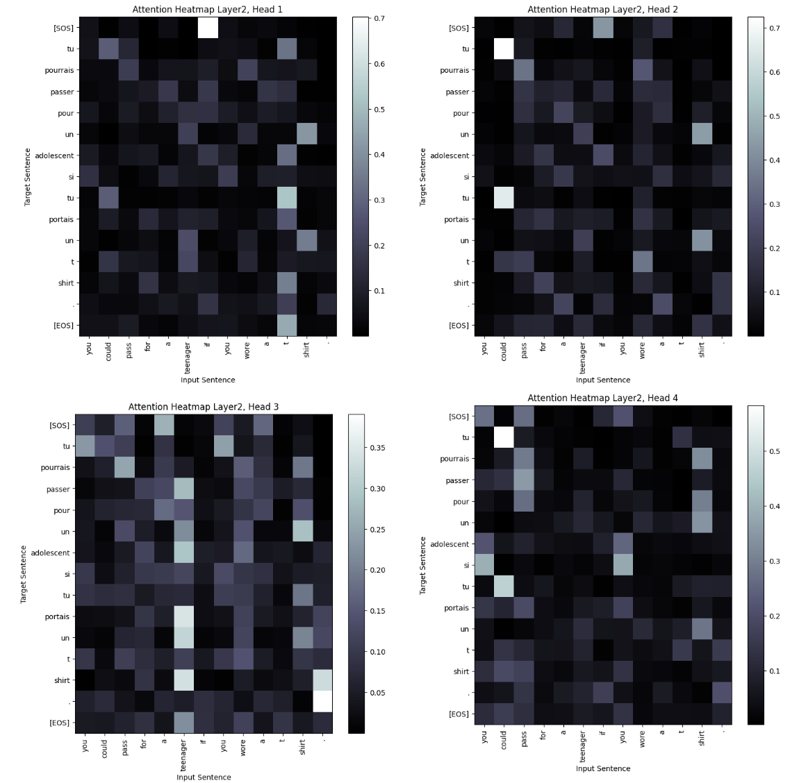

# NLP-Assignment04
**작성자** : `2019136056 박세현`
**제출일** : `2024/05/07`

## 1. Attention Heatmap 출력 및 분석 (50점)

- Transformer 모델의 Attention Distribution을 Heatmap 형식으로 출력하시오.
	- Attention Heatmap을 출력한 후 비교, 분석 하시오.
		- 학습전, 학습후(최소 10epoch 이상)의 차이
		- Head별 분석
		- Layer별 분석

**GRADING**
- Heatmap 출력 (+20점)
- Heatmap 비교 분석 (+30점)

### (1) Attention Distribution 을 내보내기 위한 코드 수정

Attention Distribution 을 Heatmap 으로 출력하기 위해서 모델을 구성하는 코드에서 Attention Distribution 을 반환하도록 코드를 적절히 수정해야 한다. 이를 위해 코드를 수정한 사항은 다음과 같다.

**MultiHeadAttention**

```python
def forward(self, q, k, v, mask):
	batch_size = q.size(0)

	q = self.Wq(q)
	k = self.Wk(k)
	v = self.Wv(v)

	q = self.split_heads(q, batch_size)
	k = self.split_heads(k, batch_size)
	v = self.split_heads(v, batch_size)

	attn = torch.matmul(q, k.permute(0, 1, 3, 2)) / math.sqrt(self.depth)
	attn = attn.masked_fill(mask.unsqueeze(1) == 0, -1e9)
	attn = torch.nn.functional.softmax(attn, dim=-1)

	out = torch.matmul(attn, v)
	
	out = out.permute(0, 2, 1, 3).contiguous()
	out = out.view(batch_size, -1, self.d_model)

	return self.dense(out), attn
```

- `MultiHeadAttention` 의 `forward` 메소드에서 Attention Distribution 을 반환하도록 수정했다.
- `attn = torch.nn.functional.softmax(attn, dim=-1)` 이 코드가 실행되면 Attention Score 를 기반으로 Attentioin Distribution 이 만들어진다.
- Heatmap 출력을 위해 이 부분이 필요하기 때문에 기존 output 과 함께 반환하도록 수정했다.

**TransformerEncoderLayer**
`MultiHeadAttention` 을 수정했기 때문에 이를 사용하는 Encoder, Decoder 에서 반환값을 적절히 받도록 수정해야 한다.
먼저, `TransformerEncoderLayer` 에서 사용하는 mha 는 **Self-Attention** 이다. 이때의 Attention Distribution 은 Heatmap 으로 표현하고자 하는 것이 아니기 때문에 반환값을 무시하도록 아래와 같이 수정하였다.

- `attn_output, _ = self.mha(x, x, x, padding_mask)` 

**TransformerDecoderLayer**
`TransformerDecoderLayer` 에서 mha 를 2번 사용한다. **Self-Attention** 과 **General Attention** 이다. 그 중 우리가 필요한 것은 **General Attention** 이기 때문에 아래와 같이 2개의 mha 의 반환값을 수정하였다.

- `attn1, _ = self.mha1(x, x, x, look_ahead_mask)`
	- Self-Attention 이므로 반환값 사용 X
- `attn2, attn_dist = self.mha2(out1, enc_output, enc_output, padding_mask)`
	- 우리가 필요한 Attention Distribution
- `return out3, attn_dist`

또한, 이렇게 받아낸 Attention Distribution 을 다시 반환하도록 수정하였다.

**TransformerDecoder**

```python
class TransformerDecoder(nn.Module):
	def __init__(self, num_layers, d_model, num_heads, dff, dropout_rate):
		super(TransformerDecoder, self).__init__()
		self.dec_layers = nn.ModuleList([TrasnformerDecoderLayer(d_model, num_heads, dff, dropout_rate) for _ in range(num_layers)])
		self.dropout = nn.Dropout(dropout_rate)

	def forward(self, x, enc_output, look_ahead_mask, padding_mask):
		attn_dist = {}
		for i, dec_layer in enumerate(self.dec_layers):
			x, dist = dec_layer(x, enc_output, look_ahead_mask, padding_mask)
			attn_dist['Layer{}'.format(i+1)] = dist
		return x, attn_dist
```

`TransformerDecoder` 는 DecoderLayer 를 쌓는 역할을 한다. Attention Heatmap 을 Layer 별로 비교하기 위해 최종적으로 반환하는 Attention Distribution 은 Dictionary 형태로 만들어 Layer 별 Attention Distribution 을 모아서 반환하다.

이를 통해 Layer 별 Attentioin Distribution 과 각 Layer 의 Head 별 Attention DIstribution 을 최종적으로 얻을 수 있다.

**Transformer**

```python
def forward(self, enc_input, dec_input, enc_padding_mask, look_ahead_mask, dec_padding_mask):
	enc_output = self.encode(enc_input, enc_padding_mask)
	dec_output, attn_dist = self.decode(dec_input, enc_output, look_ahead_mask, dec_padding_mask)
	final_output = self.final_layer(dec_output)
	return final_output, attn_dist
```

마지막으로 `Transformer` 에서 Decoder 에서 반환하는 Attention Distribution 을 최종 output 과 함께 반환하도록 수정한다.

**TransformerPL**

```python
def get_attention_distribution(self, src, trg):
	enc_padding_mask = self.make_pad_mask(src, src)
	dec_padding_mask = self.make_pad_mask(trg, src)
	look_ahead_mask = self.make_causal_mask(trg)

	_, attn_dist = self.model(src, trg, enc_padding_mask, look_ahead_mask, dec_padding_mask)

	return attn_dist
```

모든 Input/Target Sequence 에 대한 Heatmap 을 출력할 수는 없으므로 특정한 Sample 에 대해서 Attention Distribution 을 받아올 수 있도록 `TransformerPL` 에 **get_attention_distribution** 메소드를 추가해 일관된 Input/Target Sequence 에 대한 학습 전/후 비교를 할 수 있도록 하였다.

### (2) Attention Heatmap 을 출력하기 위한 과정

**Sample 추출 및 Attention Distribution 추출**

```python
test_data = test_dataset.__getitem__(1000)
src = test_data["src"].unsqueeze(0)
trg = test_data["trg"].unsqueeze(0)

input = " ".join([list(en_vocab.keys())[list(en_vocab.values()).index(i)] for i in test_data["src"]])
target = " ".join([list(fr_vocab.keys())[list(fr_vocab.values()).index(i)] for i in test_data["trg"]])

attn_dist = model_pl.get_attention_distribution(src, trg)
```

위 코드를 통해 Sample 을 가져올 수 있고 이에 대한 Attention Distribution 을 받아올 수 있다. 추출한 Sample 은 아래와 같다.

- **Input** : you could pass for a teenager if you wore a t shirt .
- **Target** : [SOS] tu pourrais passer pour un adolescent si tu portais un t shirt . [EOS]

각 토큰이 어떻게 대응되는지 표로 정리하면 다음과 같다.

| English  |   French   |
| :------: | :--------: |
|   you    |     tu     |
|  could   |  pourrais  |
|   pass   |   passer   |
|   for    |    pour    |
|    a     |     un     |
| teenager | adolescent |
|    if    |     si     |
|   you    |     tu     |
|   wore   |  portais   |
|    a     |     un     |
|    t     |     t      |
|  shirt   |   shirt    |
|    .     |     .      |

**Heatmap 표현**

```python
from matplotlib import pyplot as plt

def plot_attention_heatmap_without_padding(attention, input, target, layer_name, head_idx):
	plt.figure(figsize=(8, 8))

	# PAD 토큰 제거
	input = [word for word in input.split() if word != '[PAD]']
	target = [word for word in target.split() if word != '[PAD]']
	attention = attention[:, :len(target), :len(input)]

	# Heatmap
	plt.imshow(attention[head_idx], cmap='bone', aspect='auto')
	plt.title(f'Attention Heatmap {layer_name}, Head {head_idx+1}')
	plt.xlabel('Input Sentence')
	plt.ylabel('Target Sentence')
	plt.xticks(np.arange(len(input)), input, rotation=90)
	plt.yticks(np.arange(len(target)), target)
	plt.colorbar()
	plt.show()

for layer_name, attention in attn_dist.items():
	num_heads = attention.size(1)
	for head_idx in range(num_heads):
		plot_attention_heatmap_without_padding(attention.squeeze(0).detach().numpy(), input, target, layer_name, head_idx)
```

위 코드를 통해 Heatmap 을 표현할 수 있다. Attention Distribution 에는 PAD 토큰에 대한 값들도 포함되어 있는데 시각적으로 가독성을 높이기 위해 Input/Target Sequence 와 Attention Distribution 에서 PAD 토큰에 대한 부분은 제외했다.

### (3) Attention Heatmap 비교

**학습 전/후 Layer 및 Head 별 비교**
- 학습은 10 epoch 를 진행하고 학습 전/후에 대한 비교를 진행한다.
- Layer 는 2개, Head 는 4개로 구성하였다.
	- 기존 Head 의 수는 8개이지만 비교의 편의성을 위해 4개로 설정하였다.


- 위 4가지 이미지는 학습 전/후의 첫번째 Layer 의 4가지 Head 에 대한 비교 이미지이다. 좌측이 학습 전, 우측이 학습 후의 Attention Distribution 이다.

단순히 값들의 분포만 확인해도 10 epoch 을 학습한 후의 Attention Distribution 이 나은 분포를 보여준다. 기존에는 각 영어 토큰에 대한 프랑스 토큰과의 확률값이 무분별하게 분포되어 있지만, 학습 후에는 대부분의 경우 연관없는 토큰은 검은색 (낮은 확률)으로, 연관이 있는 토큰은 밝은색 (높은 확률)으로 분포되어 있는 것을 확인할 수 있다.

**Layer 별, Head 별 비교**


- Layer 1, 4개의 Head 별 Attention Distribution

Multi-Head Attention 을 통해 우리는 같은 입력에 대해 다양한 관점에서 정보를 파악하기를 기대한다. 각 Head 별 토큰을 생성할 때 Encoder 의 어떤 정보를 참고했는지 알아본다.

먼저, Head 1 에서 높은 확률(밝은색) 으로 연결된 부분은 **if(en)-si(fr)** 이다. 이는 실제 대응되는 토큰으로 Decoder 가 si 라는 프랑스어 토큰을 생성할 때 Encoder 의 if 토큰에 영향을 많이 받았다는 것을 알 수 있고 기대했던 방향으로 동작한 것을 볼 수 있다.

Head 2 는 다른 Head 에 비해 Attention Distribution 이 고르게 퍼져있지 못한 것처럼 보인다.

Head 3 와 Head 4 는 특정 Token 들에 집중하고 있으며 Head 1 과는 다른 **for(en)-pour(fr)** Token 에서 높은 확률을 보이고 있다.

이를 통해 알 수 있는 것은 같은 입력에 대해 다른 관점에서 Encoder 의 중요한 정보가 무엇인지 파악하고 있음을 볼 수 있다.



- Layer 2, 4개의 Head 별 Attention Distribution

두번째 Layer 에서도 특정 토큰에 집중하고 있는 Head, 고르게 분포되지 못한 Head 등이 표현되고 있으며 첫번째 Layer 각 Head 와는 또 다른 분포를 보여주고 있다. 

---
## 2. Transformer의 장점, 단점 (50점)

- RNN 계열 모델, CNN 계열 모델에 대비 Transformer의 장단점을 서술하시오.
	- 지금까지한 실습, 과제에 기반해 근거를 제시하시오.

### (1) 장점

**병렬 처리**


위 사진은 실습에 사용된 Seq2Seq 모델의 1 epoch 학습 시간이다. RNN 계열의 모델은 병렬로 처리할 수 없어 GPU 를 효율적으로 사용하기 힘들다는 단점이 있다. 그로 인해 학습 시간이 꽤나 많이 소요된다.


하지만 Transformer 의 `Self-Attention` 은 병렬처리가 가능하므로 이를 사용해 구성한 Transformer 모델의 학습 시간은 Seq2Seq 대비 크게 감소한 것을 알 수 있다.

Transformer 의 장점 중 하나는 병렬처리로 인해 학습시간이 감소한다는 것을 꼽을 수 있다.


TextCNN 과의 비교는 데이터셋, 모델의 크기, 파라미터의 크기, Task 등이 다르기 때문에 정확한 비교는 어렵지만 아무래도 CNN 이 병렬처리에 조금 더 특화되어 있기 때문에 1 epoch 을 학습하는데 걸리는 시간은 CNN 이 조금 더 낫다고 생각한다. 하지만 CNN 은 지역적인 정보를 파악하는데 강점이 있기 때문에 전체 Seqeunce 의 복잡한 관계를 학습하는 관점에서 Transformer 가 자연어처리에서 크게 우수하다고 생각한다.

**문장 생성 능력**

Seq2Seq 모델과 Transformer 의 문장 생성 결과를 비교해본다.


위는 Seq2Seq 모델로 생성한 문장이다. 비슷하게 생성한 부분도 있지만 대체적으로 틀린 부분들이 많다.


Transformer 로 생성한 문장은 Seq2Seq 모델에 비해 조금 더 많이 맞추는 모습을 보인다. Attentnion Mechanism 으로 Information Bottleneck 문제를 해결할 수 있고 PAD, Casual Masking 을 통한 Selt-Attentnion 등 다양한 기법들이 더해져 조금 더 우수한 문장 생성 능력을 보여준다.

**학습 과정 및 성능**


Transformer 와 Seq2Seq 의 Train Loss 와 Validation Loss 에 대한 그래프를 비교한 것이다. Transformer 가 Seq2Seq 에 비해 빠르게 Loss 를 감소시켜나가며 안정적으로 Loss 를 줄여나가는 것을 볼 수 있다. 반면 Seq2Seq 는 1 epoch 만을 학습했는데도 불구하고 Loss 의 감소가 둔한 것을 볼 수 있다.

RNN 계열의 모델은 긴 Sequence 에서 Gradient 가 소실될 수 있는 문제를 가지고 있다. Vanilla RNN 에서 그러한 문제를 해결하기 위해 LSTM 이라는 아키텍처가 제안되었지만 LSTM 이 Gradient Vanishing 문제를 완벽히 해결한다고 보장하지는 못한다. 하지만 Attentnion Mechanism 을 사용하는 Transformer 는 이러한 문제를 조금 더 잘 해결할 수 있다. 그로 인해 그래프에서도 나타나듯 Loss 의 감소가 더욱 안정적으로 일어나는 것으로 생각된다.
또한, Validation 에서 두 모델의 성능 차이는 더욱 확연히 나타나는데 Transformer 가 새로운 입력에 대한 일반화 능력이 우수하다고 볼 수 있다.

### (2) 단점

**계산 비용과 메모리 사용량**


Transformer 는 Self-Attention 을 위해 많은 메모리를 사용한다. Wandb 의 시스템 자원 사용 그래프 중 GPU 메모리에 대한 그래프를 Seq2Seq 모델과 비교했을 때, 훨씬 더 많이 메모리를 사용하는 것을 볼 수 있다.

모델의 크기는 Transformer 가 Seq2Seq 에 비해 작지만 메모리는 더 많이 사용하는데 Transformer 의 모델 크기를 키울수록 더 많은 메모리를 사용할 것이다. 다행인 점은 현재 출시되는 고성능 GPU 메모리가 많이 증가했다는 것이다.