# NLP Assignment05
**작성자** : `2019136056 박세현`
**제출일** : `2024/05/21`

## 1. IMDB PLM 학습 (45점)

* HW 2에서 진행한 IMDB 데이터셋을 학습 및 분류하는 PLM 기반 분류기를 작성하시오.
	* 실습에 사용하지 않은 PLM 모델을 huggingface hub에서 불러와 사용하시오.
		* 실습에 사용한 데이터는 한국어 데이터이지만 IMDB의 경우 영어 데이터임
* 최소 3개의 PLM을 동일 hyperparameter를 통해 학습 및 평가 해 보고 성능을 비교 분석 하시오
	* 각자가 구현 및 제출한 HW2의 모델과 비교하여 어떠한지
	* 각 PLM 별로 성능이 어떠하고 왜 그런지

**GRADING**
* PLM 1개당 15점 (총 45점)

### IMDB 데이터셋 다운로드 및 전처리

```python
from requests import get  

def download(url, filename):  
    with open(filename, "wb") as file:  
        response = get(url)  
        file.write(response.content)  
  
download("https://ai.stanford.edu/~amaas/data/sentiment/aclImdb_v1.tar.gz", "aclImdb_v1.tar.gz")
```

```python
from pathlib import Path  
  
raw_data_dir = './aclImdb'  
data_dir = Path(raw_data_dir)  
  
train_datas = []  
test_datas = []  
  
for sentiment in ["pos", "neg"]:  
    samples = list(data_dir.glob(f"train/{sentiment}/*.txt"))  
    train_datas.extend(samples)  
  
for sentiment in ["pos", "neg"]:  
    samples = list(data_dir.glob(f"test/{sentiment}/*.txt"))  
    test_datas.extend(samples)  
  
train_file = open("train.txt", "w", encoding="utf-8")  
test_file = open("test.txt", "w", encoding="utf-8")  
  
for file, datas in [(train_file, train_datas), (test_file, test_datas)]:  
    file.write("id\ttext\tlabel\n")  
    for data in datas:  
        lines = [line.strip().replace("\t", " ") for line in data.open().readlines()]  
        text = " ".join(lines)  
        id = data.name[:-4]  
        label = 1 if "pos" in data.parts else 0  
        file.write(f"{id}\t{text}\t{label}\n")  
  
train_file.close()  
test_file.close()
```

```python
with open("train.txt", "r", encoding="utf-8") as file:  
    contents = file.read()  
    lines = contents.split("\n")[1:]  
    train_data = [line.split("\t") for line in lines if len(line) > 0]  
  
with open("test.txt", "r", encoding="utf-8") as file:  
    contents = file.read()  
    lines = contents.split("\n")[1:]  
    test_data = [line.split("\t") for line in lines if len(line) > 0]
```

먼저 `IMDB` 데이터셋을 다운로드 받고 위와 같이 `train.txt` `test.txt` 파일로 만들어준다.

### Dataset, LightningModel 클래스 정의

```python
from torch.utils.data import Dataset, DataLoader  
  
class SentimentDataset(Dataset):  
    def __init__(self, data, tokenizer):  
        self.data = data  
        self.tokenizer = tokenizer  
  
    def __len__(self):  
        return len(self.data)  
  
    def __getitem__(self, index):  
        label = int(self.data[index][2])  
        text = self.data[index][1]  
        inputs = self.tokenizer(text, return_tensors="pt", padding="max_length", truncation=True, max_length=128)  
        inputs = {key: inputs[key].squeeze() for key in inputs}  
  
        return inputs|{'label':torch.tensor(label)}
```

- `tokenizer` 는 `AutoTokenizer` 를 생성자로 받아 사용한다.

```python
import lightning as pl  
  
class SentimentClassifierPL(pl.LightningModule):  
    def __init__(self, sentiment_classifier):  
        super(SentimentClassifierPL, self).__init__()  
        self.model = sentiment_classifier  
  
        self.validation_step_outputs = []  
        self.test_step_outputs = []  
        self.save_hyperparameters()  
  
    def forward(self, inputs):  
        return self.model(inputs)  
  
    def training_step(self, batch, batch_idx):  
        labels = batch.pop('label')  
        outputs = model(**batch, labels=labels)  
        loss = outputs.loss  
        logits = outputs.logits  
        self.log("train_loss", loss)  
        return loss  
  
    def validation_step(self, batch, batch_idx):  
        labels = batch.pop('label')  
        outputs = model(**batch, labels=labels)  
        loss = outputs.loss  
        logits = outputs.logits  
        self.log("val_loss", loss)  
        self.validation_step_outputs.append((loss, logits, labels))  
        return loss, outputs, labels  
  
    def on_validation_epoch_end(self):  
        outputs = self.validation_step_outputs  
        avg_loss = torch.stack([x[0] for x in outputs]).mean()  
        self.log("avg_val_loss", avg_loss)  
  
        all_outputs = torch.cat([x[1] for x in outputs])  
        all_labels = torch.cat([x[2] for x in outputs])  
        all_preds = all_outputs.argmax(dim=1)  
        accuracy = (all_preds == all_labels).float().mean()  
        self.log("val_accuracy", accuracy)  
        self.validation_step_outputs.clear()  
  
    def test_step(self, batch, batch_idx):  
        labels = batch.pop('label')  
        outputs = model(**batch, labels=labels)  
        loss = outputs.loss  
        logits = outputs.logits  
        self.log("test_loss", loss)  
        self.test_step_outputs.append((loss, logits, labels))  
        return loss, outputs, labels  
  
    def on_test_epoch_end(self):  
        outputs = self.test_step_outputs  
        avg_loss = torch.stack([x[0] for x in outputs]).mean()  
        self.log("avg_test_loss", avg_loss)  
  
        all_outputs = torch.cat([x[1] for x in outputs])  
        all_labels = torch.cat([x[2] for x in outputs])  
        all_preds = all_outputs.argmax(dim=1)  
        accuracy = (all_preds == all_labels).float().mean()  
        self.log("test_accuracy", accuracy)  
        self.test_step_outputs.clear()  
  
    def configure_optimizers(self):  
        optimizer = torch.optim.AdamW(self.model.parameters(), lr=5e-6)  
        return optimizer
```

### (1) DistilBert

```python
from transformers import AutoTokenizer, AutoModelForSequenceClassification
  
plm_name = "lvwerra/distilbert-imdb"  
  
tokenizer = AutoTokenizer.from_pretrained(plm_name)  
model = AutoModelForSequenceClassification.from_pretrained(plm_name, num_labels=2)
```

첫번째로 사용한 모델은 `lvwerra/distillbert-imdb` 이다.
`DistilBert` 는 Knowledge Distillation 을 사용해 BERT 의 문제점으로 지적되던 큰 파라미터 문제를 극복하기 위한 연구에서 만들어진 모델이다.
기존 BERT 와 비교해 더 작은 모델이지만 성능은 비슷한 모델로 Pre-training 단계에서 BERT 대비 모델 크기를 40%로 줄이고 60% 빠르지만 성능은 97% 정도로 거의 떨어지지 않는다고 한다.

```python
pl_model = SentimentClassifierPL(model)

check_performance(pl_model, tokenizer, train_data, test_data, "DistilBert-IMDB")
```

위와 같이 모델을 선언하고 학습을 진행한다.

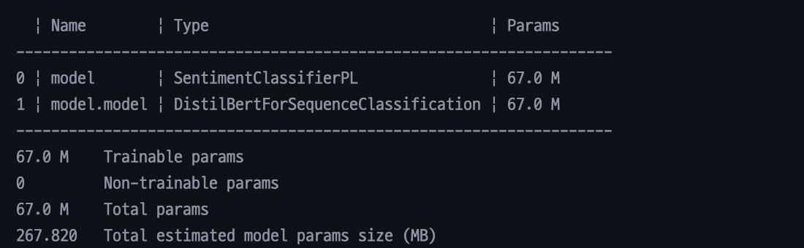

모델의 크기는 위와 같다.

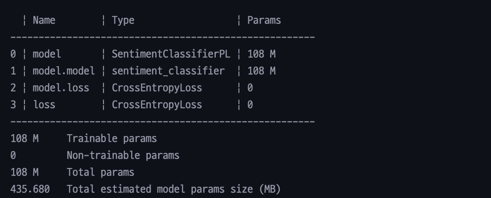

실습 때 학습한 BERT 와 모델 크기를 비교해보면 모델의 크기가 약 40% 작다는 것을 확인할 수 있다.

### (2) XLNet

```python
plm_name = "textattack/xlnet-base-cased-imdb"

tokenizer = AutoTokenizer.from_pretrained(plm_name)
model = AutoModelForSequenceClassification.from_pretrained(plm_name, num_labels=2)
```

두번째로 사용한 모델은 `textattack/xlnet-base-cased-imdb` 이다. 
`XLNet` 은 GPT 와 같은 Attention Decoder 기반의 모델의 장점과 BERT 와 같은 Attention Encoder 기반의 모델의 장점을 합한 모델이다.

```python
pl_model = SentimentClassifierPL(model)
check_performance(pl_model, tokenizer, train_data, test_data, "XLNet-IMDB")
```

이전과 같이 모델을 선언하고 학습을 진행한다.

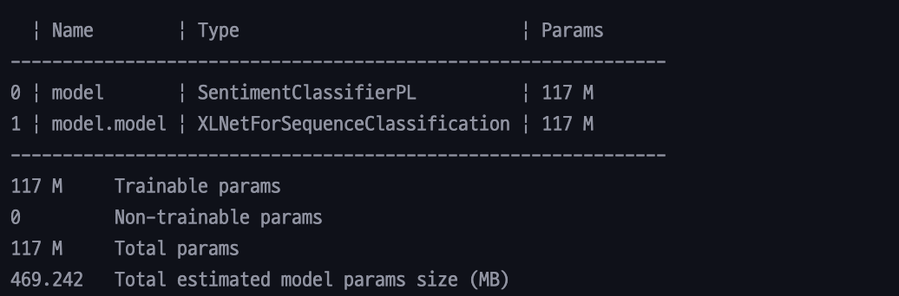

모델의 크기는 위와 같다.
### (3) OPT

```python
plm_name = "edbeeching/opt-125m-imdb"  
  
tokenizer = AutoTokenizer.from_pretrained(plm_name)  
model = AutoModelForSequenceClassification.from_pretrained(plm_name, num_labels=2)
```

세번째로 사용한 모델은 `edbeeching/opt-125m-imdb` 이다.
`OPT` 는 Meta 에서 공개한 `Open Pre-trained Transformer Model` 이다. 125M ~ 175B 파라미터의 다양한 크기로 구성된 디코더 기반 모델 중 125M 파라미터 모델을 사용했다. 

```python
pl_model = SentimentClassifierPL(model)
check_performance(pl_model, tokenizer, train_data, test_data, "OPT-IMDB")
```

이전과 같이 모델을 선언하고 학습을 진행한다.

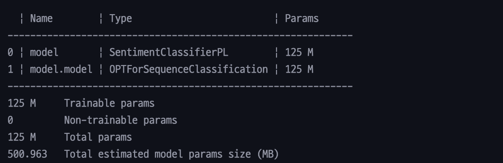

모델의 크기는 위와 같다.

### 성능 비교

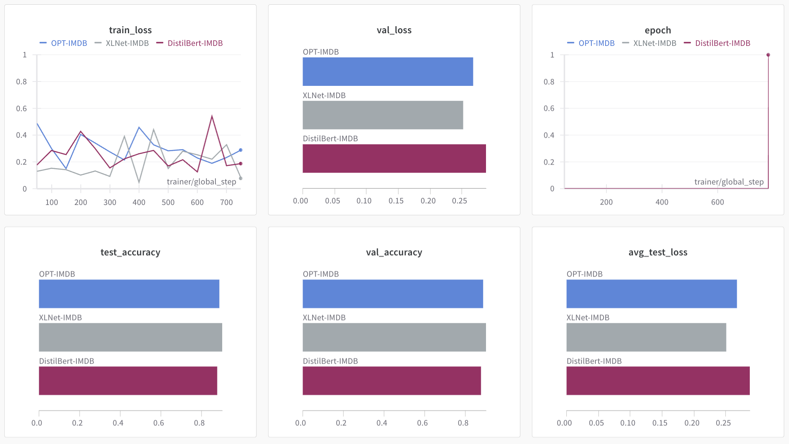

3가지 PLM 의 Wandb 그래프는 위와 같다.

먼저 `Accuracy` 를 비교해본다.

|  Model   | DistilBert |   XLNet    |    OPT     | CNN+biLSTM(과제) |
| :------: | :--------: | :--------: | :--------: | :------------: |
| Accuracy | **87.65%** | **90.17%** | **88.89%** |   **88.04%**   |

가장 성능이 좋은 모델은 `XLNet` 이다.
`XLNet` 은 GPT 계열의 모델과 BERT 계열의 모델의 장점을 합쳐 만든 모델로 NLP 의 다양한 Task 에서 SOTA 를 달성한 것으로 알고 있다. 하지만 1 epoch 학습에 걸리는 시간은 다른 모델들 중 가장 오래걸렸다.

인상 깊은 모델은 `DistilBert` 이다.
실습에서 사용했던 BERT 는 약 2분이 넘는 시간이 걸린 것에 비해 `1분 11초` 라는 빠른 속도로 높은 성능을 보여주었다.

또한 과제를 진행하며 만들었던 모델은 여러 epoch 을 학습하고 다양한 실험의 과정을 통해 약 88% 의 성능을 달성했다. 하지만 PLM 을 사용했을 때 1 epoch 만을 학습했고 실험의 과정없이 PLM 을 불러오고 전처리 과정도 없이 학습을 시켰는데도 비슷하거나 높은 성능이 나왔다. 1% 성능을 높이기 위해 시도했던 지난 실험들이 허무하기도 하면서 이런 모델들을 잘 비교하고 사용할 줄 알면 문제를 해결하는 모델을 만들어가는데 많은 도움이 될 것이라 생각된다.

---

## 2. Hyperparameter 조정 (15점)

* 1번 과제의 가장 성능이 좋은 모델을 통해 hyperparameter 변화에 따른 성능을 비교하시오.
	* Batch size, learning rate에 대한 성능 비교 필수

**GRADING**
* Hyperparameter 당 5점 (총 15점)

> Batch Size, Learning Rate, Epoch 를 조절하면서 성능 변화를 관찰한다.

### PL Model, check_performance 수정

```python
import lightning as pl  
  
class SentimentClassifierPL(pl.LightningModule):  
    def __init__(self, sentiment_classifier, lr):  
        super(SentimentClassifierPL, self).__init__()  
        self.model = sentiment_classifier  
        self.lr = lr  
  
        self.validation_step_outputs = []  
        self.test_step_outputs = []  
        self.save_hyperparameters()  
  
    def forward(self, inputs):  
        return self.model(inputs)  
  
    def training_step(self, batch, batch_idx):  
        labels = batch.pop('label')  
        outputs = model(**batch, labels=labels)  
        loss = outputs.loss  
        logits = outputs.logits  
        self.log("train_loss", loss)  
        return loss  
  
    def validation_step(self, batch, batch_idx):  
        labels = batch.pop('label')  
        outputs = model(**batch, labels=labels)  
        loss = outputs.loss  
        logits = outputs.logits  
        self.log("val_loss", loss)  
        self.validation_step_outputs.append((loss, logits, labels))  
        return loss, outputs, labels  
  
    def on_validation_epoch_end(self):  
        outputs = self.validation_step_outputs  
        avg_loss = torch.stack([x[0] for x in outputs]).mean()  
        self.log("avg_val_loss", avg_loss)  
  
        all_outputs = torch.cat([x[1] for x in outputs])  
        all_labels = torch.cat([x[2] for x in outputs])  
        all_preds = all_outputs.argmax(dim=1)  
        accuracy = (all_preds == all_labels).float().mean()  
        self.log("val_accuracy", accuracy)  
        self.validation_step_outputs.clear()  
  
    def test_step(self, batch, batch_idx):  
        labels = batch.pop('label')  
        outputs = model(**batch, labels=labels)  
        loss = outputs.loss  
        logits = outputs.logits  
        self.log("test_loss", loss)  
        self.test_step_outputs.append((loss, logits, labels))  
        return loss, outputs, labels  
  
    def on_test_epoch_end(self):  
        outputs = self.test_step_outputs  
        avg_loss = torch.stack([x[0] for x in outputs]).mean()  
        self.log("avg_test_loss", avg_loss)  
  
        all_outputs = torch.cat([x[1] for x in outputs])  
        all_labels = torch.cat([x[2] for x in outputs])  
        all_preds = all_outputs.argmax(dim=1)  
        accuracy = (all_preds == all_labels).float().mean()  
        self.log("test_accuracy", accuracy)  
        self.test_step_outputs.clear()  
  
    def configure_optimizers(self):  
        optimizer = torch.optim.AdamW(self.model.parameters(), lr=self.lr)  
        return optimizer
```

```python
import wandb  
from lightning.pytorch.loggers import WandbLogger  
from lightning.pytorch.callbacks import ModelSummary  
  
wandb.login()  
  
def check_performance(model,tokenizer, train_data, test_data, epoch, batch, lr, wandb_log_name):  
    wandb_logger = WandbLogger(project="NLP", name=wandb_log_name, group="HW05")  
  
    pl_model = SentimentClassifierPL(model, lr)  
  
    train_dataset = SentimentDataset(train_data,tokenizer)  
    train_loader = DataLoader(train_dataset, batch_size=batch, shuffle=True)  
    val_dataset = SentimentDataset(test_data,tokenizer)  
    val_loader = DataLoader(val_dataset, batch_size=batch, shuffle=False)  
    test_dataset = SentimentDataset(test_data,tokenizer)  
    test_loader = DataLoader(test_dataset, batch_size=batch, shuffle=False)  
  
    trainer = pl.Trainer(  
        max_epochs=epoch,  
        accelerator="gpu",  
        logger=wandb_logger,  
        callbacks=[ModelSummary(max_depth=2)],  
        precision=16  
    )  
  
    trainer.fit(  
        model=pl_model,  
        train_dataloaders=train_loader,  
        val_dataloaders=val_loader  
    )  
  
    trainer.test(dataloaders=test_loader)  
  
    wandb.finish()
```

3가지 하이퍼 파라미터를 바꾸면서 실험하기 용이하게 이들을 인자로 받도록 코드를 수정하였다.

### (1) Batch Size 조절

```python
lr = 5e-6  
pl_model = SentimentClassifierPL(model, lr)
check_performance(pl_model, tokenizer, train_data, test_data, 1, 16, lr, "XLNet-Batch16")
```

```python
lr = 5e-6  
pl_model = SentimentClassifierPL(model, lr)
check_performance(pl_model, tokenizer, train_data, test_data, 1, 128, lr, "XLNet-Batch128")
```

기존 학습 시 `Batch Size` 는 **32** 이다.
**16, 128** 로 변경해서 학습을 진행해보았다.
- 그 이상의 Batch Size 는 GPU 메모리 문제로 실험해보지 못했다는 것이 아쉽다.

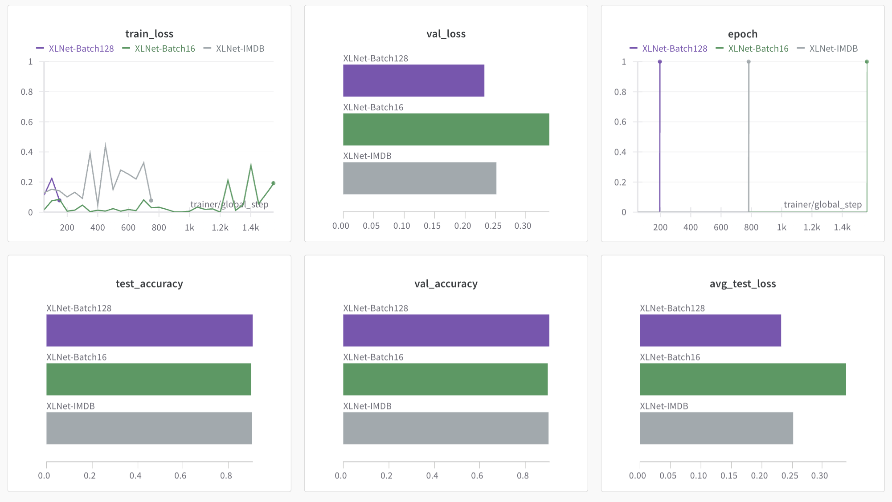

학습 결과는 위와 같다.

| Batch Size |     16     |     32     |    128     |
| :--------: | :--------: | :--------: | :--------: |
|  Accuracy  | **89.87%** | **90.18%** | **90.47%** |
성능을 비교하면 Batch Size 가 증가할수록 조금씩 높아지는 것을 확인할 수 있다.
Batch 가 클수록 병렬 처리 효율도 증가하고 안정적으로 Gradient 를 업데이트 할 수 있는 등 다양한 요인으로 인해 성능이 조금 더 개선되는 것 같다.

### (2) Learning Rate

```python
lr = 1e-6  
pl_model = SentimentClassifierPL(model, lr)  
check_performance(pl_model, tokenizer, train_data, test_data, 1, 32, lr, "XLNet-LR1e-6")
```

```python
lr = 3e-5  
pl_model = SentimentClassifierPL(model, lr)  
check_performance(pl_model, tokenizer, train_data, test_data, 1, 32, lr, "XLNet-LR3e-5")
```

기존 `Learning Rate` 는 **5.0e-6** 이다.
굉장히 낮은 값이라 생각해 **1.0e-6, 3.0e-5** 로 조정해 학습을 진행해보았다.
정확한 비교를 위해 앞서 진행한 Batch Size 는 기존과 동일하게 32로 설정하고 학습을 진행했다.

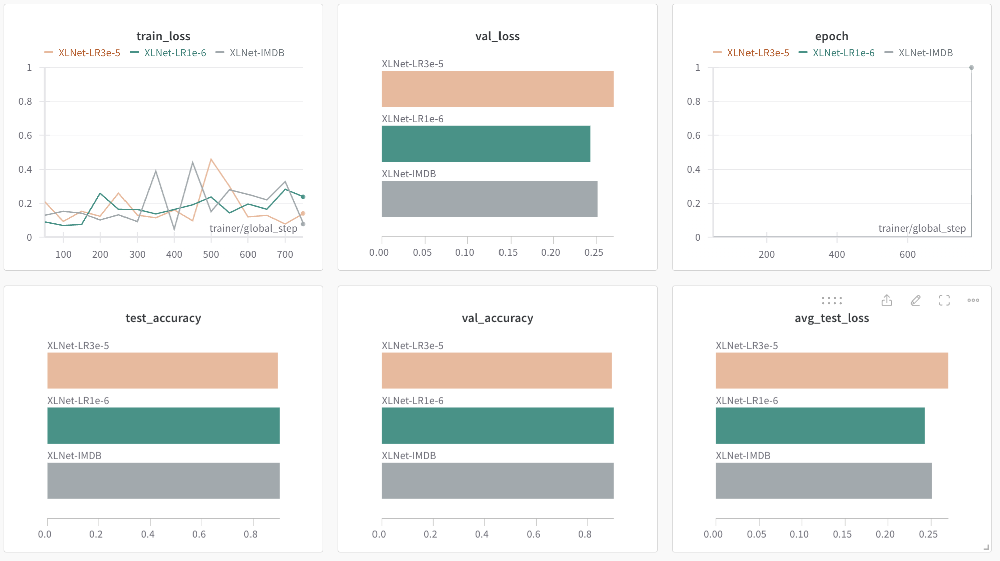

학습 결과는 위와 같다.

| Learning Rate |   5.0e-6   |   1.0e-6   |   3.0e-5   |
| :-----------: | :--------: | :--------: | :--------: |
|   Accuracy    | **90.18%** | **90.21%** | **89.54%** |
성능을 비교하면 `5.0e-6 -> 1.0e-6` 으로 Learning Rate 를 높였을 때는 성능이 증가했지만, `5.0e-6 -> 3.0e-5` 로 높였을 때는 성능이 하락했다.
근소한 차이기 때문에 정확한 비교가 아닐 수 있지만 1 epoch 을 학습할 때 초기 Learning Rate 가 크게 증가하면 빠르게 학습 할 수는 있지만 안정성은 떨어질 수 있다고 생각한다. epoch 가 늘어나면 학습 초기에는 Learning Rate 를 크게 설정하고 점차 감소하는 Learning Rate Decay 기법을 사용해 안정성과 학습 속도를 높일 수 있을 것이라 생각된다.

### (3) Epoch

```python
lr = 5e-6  
pl_model = SentimentClassifierPL(model, lr)  
check_performance(pl_model, tokenizer, train_data, test_data, 5, 32, lr, "XLNet-Epoch5")
```

```python
lr = 5e-6  
pl_model = SentimentClassifierPL(model, lr)  
check_performance(pl_model, tokenizer, train_data, test_data, 10, 32, lr, "XLNet-Epoch10")
```

기존에는 **1 epoch** 만을 학습했다.
따라서 `Epoch` 을 **5, 10** 으로 설정하고 더 많은 학습이 이루어졌을 때 성능이 어떻게 변하는지 관찰해보았다.

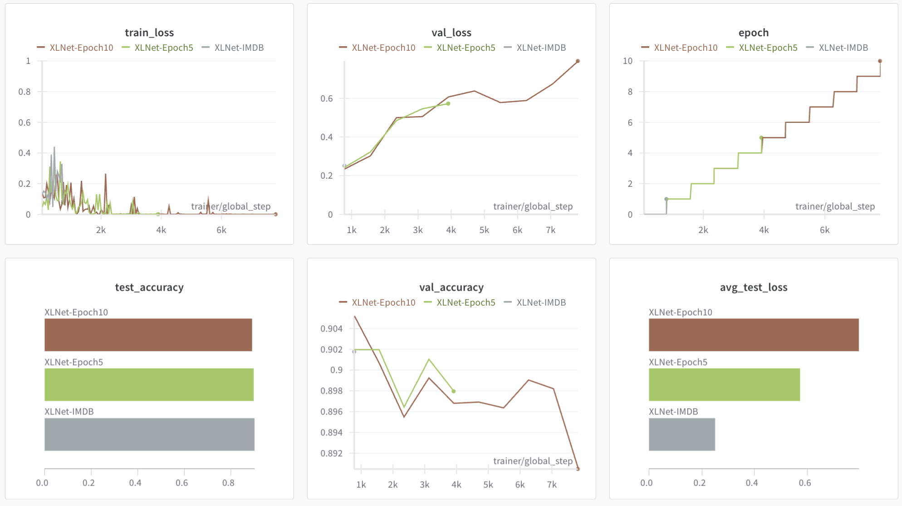

학습 결과는 다음과 같다.

Epoch 이 증가하면서 `Training Loss` 는 점차 감소한다. 이는 당연한 결과이다.
하지만 `Validation Loss` 는 반대로 계속 증가하는 것을 알 수 있다.

|  Epoch   |     1      |     5     |     10     |
| :------: | :--------: | :-------: | :--------: |
| Accuracy | **90.18%** | **89.8%** | **89.05%** |
성능 역시 감소한 것을 확인할 수 있다. 

특히 10 epoch 을 학습하는 과정에서 Validation Loss, Validation Accuracy 는 지속적으로 증가하고 감소하기 때문에 현재 상태에서 그 이상으로 학습하는 것은 Overfitting 문제를 야기할 수 있다고 생각된다.
반면, 5 epoch 은 그래도 안정적인 학습을 하는 것으로 보여지기 때문에 현재 모델은 1~5 epoch 사이에서 학습을 진행하면 좋은 성능을 낼 수 있을 것이라 생각된다.

---
## 3. T5를 통한 Machine Translation 모델 학습 (40점)

* Huggingface hub의 T5 모듈 및 weight을 통해 Seq2Seq 실습에 사용한 English-French MT모델을 구현하시오.
	* Seq2Seq 실습에 사용한 데이터셋 사용 (http://www.manythings.org/anki/fra-eng.zip)
	* T5 모델은 "google-t5/t5-small"를 사용
	* 참고: https://huggingface.co/docs/transformers/model_doc/t5#transformers.T5ForConditionalGeneration
	* 실습에 사용한 모델과의 성능 비교

**GRADING**
* 학습 및 평가 (40점)

### (1) 데이터셋 다운로드 및 전처리

```python
import requests  
  
headers = {  
    'User-Agent': 'Mozilla/5.0 (Windows NT 10.0; Win64; x64) AppleWebKit/537.36 (KHTML, like Gecko) Chrome/91.0.4472.124 Safari/537.36'  
}  
  
def download_zip(url, output_path):  
    response = requests.get(url, headers=headers, stream=True)  
    if response.status_code == 200:  
        with open(output_path, 'wb') as f:  
            for chunk in response.iter_content(chunk_size=8192):  
                f.write(chunk)  
        print(f"ZIP file downloaded to {output_path}")  
    else:  
        print(f"Failed to download. HTTP Response Code: {response.status_code}")  
  
url = "http://www.manythings.org/anki/fra-eng.zip"  
output_path = "fra-eng.zip"  
  
if not os.path.exists(output_path):  
    download_zip(url, output_path)  
  
    path = os.getcwd()  
    zipfilename = os.path.join(path, output_path)  
  
    with zipfile.ZipFile(zipfilename, 'r') as zip_ref:  
        zip_ref.extractall(path)
```

```python
def load_data(filepath):  
    with open(filepath, 'r', encoding='utf-8') as file:  
        lines = file.readlines()  
    pairs = [line.strip().split('\t')[:2] for line in lines]  
    return pairs  
  
data_path = "./fra.txt"  
data = load_data(data_path)
```

```python
def split_data(data, train_ratio=0.7, shuffle=True):  
    data= list(data)  
    if shuffle:  
        random.shuffle(data)  
    n_train = int(len(data) * train_ratio)  
    train_data = data[:n_train]  
    test_data = data[n_train:]  
    return train_data, test_data  
  
train_test_ratio = 0.9  
train, test = split_data(data, train_test_ratio)  
train, vali = split_data(train, train_test_ratio)
```

위와 같이 데이터셋을 다운로드하고 `Train, Validation, Test` 데이터로 분리한다.

### (2) 모델 학습

```python
from transformers import T5Tokenizer, T5ForConditionalGeneration  
  
plm_name = "google-t5/t5-small"  
  
tokenizer = T5Tokenizer.from_pretrained(plm_name)  
model = T5ForConditionalGeneration.from_pretrained(plm_name)
```

`google-t5/t5-small` 모델을 가지고 온다.

```python
class EnToFrDataset(Dataset):  
    def __init__(self, data, tokenizer):  
        self.data = data  
        self.tokenizer = tokenizer  
  
    def __len__(self):  
        return len(self.data)  
  
    def __getitem__(self, idx):  
        src, trg = self.data[idx]  
        src_sample = self.tokenizer(src, max_length=30, padding="max_length", truncation=True, return_tensors="pt")  
        trg_sample = self.tokenizer(trg, max_length=30, padding="max_length", truncation=True, return_tensors="pt")  
  
        input_ids = src_sample.input_ids.squeeze()  
        attention_mask = src_sample.attention_mask.squeeze()  
        label = trg_sample.input_ids.squeeze()  
  
        return {  
            "input_ids": input_ids,  
            "attention_mask": attention_mask,  
            "labels": label  
        }
```

데이터셋 클래스를 선언한다.
IMDB 감정 분류와 비슷하게 `T5Tokenizer` 를 생성자로 받아 사용하며 padding 을 위한 max_length 는 이전 실습 및 과제와 동일하게 30 으로 지정한다.

```python
import math  
import torch  
import torch.nn as nn  
import lightning as pl  
  
class TranslationModelPL(pl.LightningModule):  
    def __init__(self, model):  
        super(TranslationModelPL, self).__init__()  
        self.model = model  
        self.criterion = nn.CrossEntropyLoss(ignore_index=0)  
        self.save_hyperparameters()  
  
    def forward(self, input_ids, attention_mask, labels=None):  
        return self.model(input_ids=input_ids, attention_mask=attention_mask, labels=labels)  
  
    def training_step(self, batch, batch_idx):  
        outputs = self(**batch)  
        loss = outputs.loss  
        logits = outputs.logits  
        ppl = torch.exp(loss)  
  
        self.log("train_loss", loss, prog_bar=True)  
        self.log("train_PPL", ppl, prog_bar=True)  
        return loss  
  
    def validation_step(self, batch, batch_idx):  
        outputs = self(**batch)  
        loss = outputs.loss  
        logits = outputs.logits  
        ppl = torch.exp(loss)  
  
        self.log("val_loss", loss, prog_bar=True)  
        self.log("val_PPL", ppl, prog_bar=True)  
        return loss  
  
    def test_step(self, batch, batch_idx):  
        outputs = self(**batch)  
        loss = outputs.loss  
        logits = outputs.logits  
        ppl = torch.exp(loss)  
  
        self.log("test_loss", loss, prog_bar=True)  
        self.log("test_PPL", ppl, prog_bar=True)  
        return loss  
  
    def configure_optimizers(self):  
        return torch.optim.AdamW(self.parameters(), lr=5e-6)
```

학습을 위한 `Lightning Model` 도 선언해주며 Loss, PPL 을 Wandb 에 로깅한다.

```python
check_performance(model, tokenizer, train, vali, test, "T5-small")
```

위 코드를 통해 학습을 진행한다.

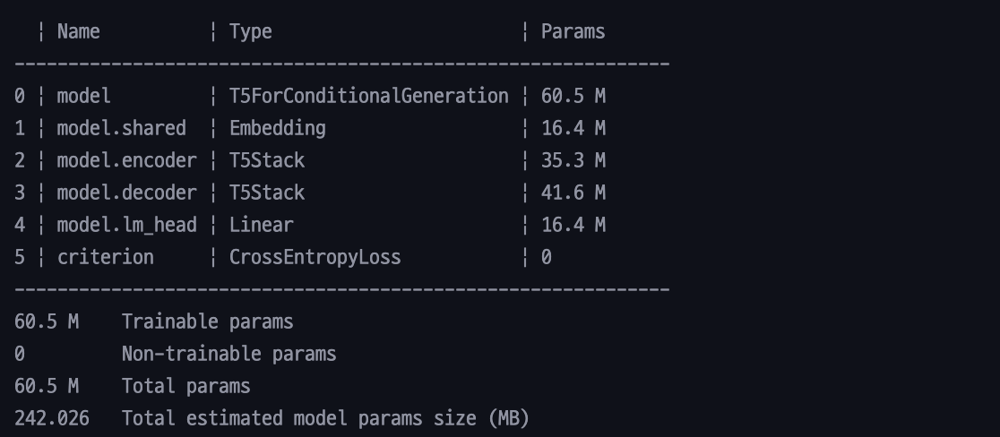

모델 Summary 는 위와 같다.

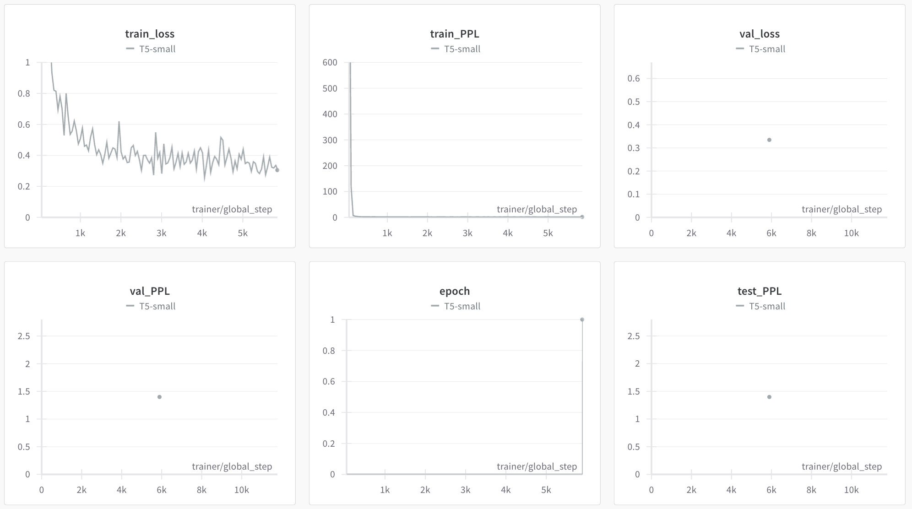

학습 결과는 위와 같다.

### (3) Test

```python
test_data = test_dataset.__getitem__(1011)  
  
src_text = tokenizer.decode(test_data["input_ids"], skip_special_tokens=True)  
target_text = tokenizer.decode(test_data["labels"], skip_special_tokens=True)
```

```python
input_ids = tokenizer.encode(src_text, return_tensors="pt")  
outputs = model.generate(input_ids, max_length=30, num_beams=4, early_stopping=True)  
model_output = tokenizer.decode(outputs[0], skip_special_tokens=True)
```

```python
print("Input:", src_text)  
print("Target:", target_text)  
print("Model Output:", model_output)
```

위와 같이 `encode, decode` 메소드를 통해 학습한 모델을 테스트 해보았다.

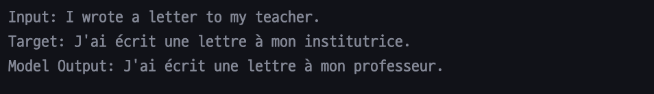

모델이 생성한 프랑스어 문장을 확인해보면 Target 과 90% 이상 일치하는 것을 확인할 수 있다.
몇번의 테스트를 진행했을 때 정확하게 번역을 하는 경우도 흔하게 있었다.

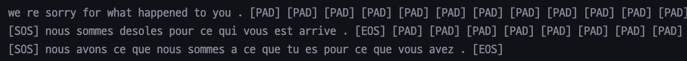

`Transformer` 모델을 사용해 출력한 결과와 비교했을 때, Seq2Seq 모델 대비 Transformer 도 유사한 의미의 문장을 생성한다고 생각했었는데 T5 모델은 그보다 훨씬 나은, 정확한 문장을 생성한다는 것이 놀라웠다.